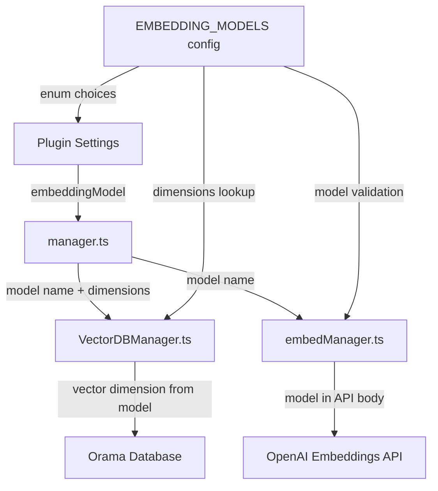
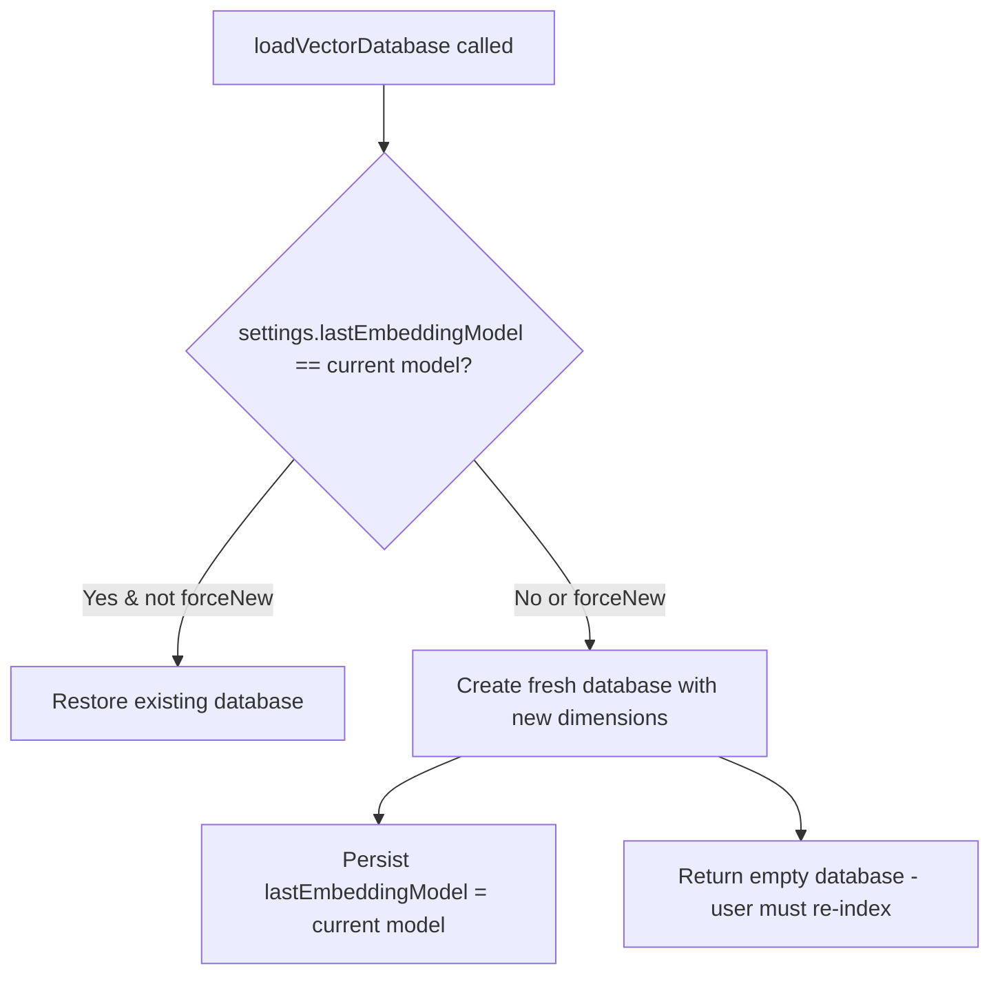

# Design Document: Embedding Model Selection

## Overview

This feature makes the OpenAI embedding model configurable in the Logseq Composer plugin. Currently, the plugin hardcodes `text-embedding-ada-002` throughout `embedManager.ts`, `VectorDBManager.ts`, and `useVectorDBIndexed.ts`. The design introduces a new plugin setting (`embeddingModel`) that flows through the entire embedding pipeline — from settings schema, through database creation, to every API call. Because different models produce different vector dimensions (and even same-dimension models produce incompatible embeddings), any model change triggers a full database recreation.

Key design decisions:
- A centralized model configuration map (`EMBEDDING_MODELS`) acts as the single source of truth for model names, dimensions, and token limits.
- The vector dimension in the Orama database schema is derived dynamically from the selected model at database creation time, replacing the hardcoded `vector[1536]`.
- Model changes are detected by comparing the current setting against a `lastEmbeddingModel` value persisted alongside the database. Any mismatch triggers a fresh database.
- The existing batch/sequential processing, timeout, and guard-flag patterns are preserved — only the model parameter is threaded through.

## Architecture

The change touches four layers of the existing architecture:



The flow:
1. User selects a model in plugin settings.
2. `manager.ts` reads the setting and passes it to both `embedManager.ts` (for API calls) and `VectorDBManager.ts` (for database creation).
3. `VectorDBManager.ts` looks up the dimension from `EMBEDDING_MODELS` and creates the Orama schema accordingly.
4. `embedManager.ts` includes the model name in every OpenAI API request body.
5. On model change, `loadVectorDatabase` detects the mismatch and creates a fresh database.

## Components and Interfaces

### 1. Embedding Model Configuration (`src/embedManager.ts`)

A new exported constant and helper functions:

```typescript
export interface EmbeddingModelConfig {
  name: string;
  dimensions: number;
  maxTokens: number;
}

export const EMBEDDING_MODELS: Record<string, EmbeddingModelConfig> = {
  'text-embedding-ada-002': { name: 'text-embedding-ada-002', dimensions: 1536, maxTokens: 8191 },
  'text-embedding-3-small': { name: 'text-embedding-3-small', dimensions: 1536, maxTokens: 8191 },
  'text-embedding-3-large': { name: 'text-embedding-3-large', dimensions: 3072, maxTokens: 8191 },
};

export const DEFAULT_EMBEDDING_MODEL = 'text-embedding-3-small';

export function getDimensionsForModel(model: string): number {
  const config = EMBEDDING_MODELS[model];
  if (!config) throw new Error(`Unknown embedding model: ${model}`);
  return config.dimensions;
}

export function isValidEmbeddingModel(model: string): boolean {
  return model in EMBEDDING_MODELS;
}
```

### 2. Updated `useGenerateEmbedding` Signature

The function gains a `model` parameter (replacing the hardcoded model string):

```typescript
export async function useGenerateEmbedding(
  inputText: string,
  apiKey: string,
  model: string = DEFAULT_EMBEDDING_MODEL
): Promise<number[]>
```

Changes inside:
- Validate `apiKey` is non-empty before making the API call (new — satisfies Requirement 4.3).
- Use `model` parameter in the request body instead of the hardcoded `'text-embedding-ada-002'`.

### 3. Updated `VectorDBManager.ts`

`loadVectorDatabase` gains a `model` parameter to create the schema with the correct vector dimension:

```typescript
export async function loadVectorDatabase(
  settings: any,
  forceNew: boolean = false,
  model: string = DEFAULT_EMBEDDING_MODEL
): Promise<Orama<VectorDBSchema>>
```

Changes:
- The `VectorDBSchema` type becomes parameterized by dimension (or we use a dynamic schema).
- `createNewDatabase()` uses `getDimensionsForModel(model)` to set the vector field size.
- On load, compare `settings.lastEmbeddingModel` with the current `model`. If they differ, force a fresh database and persist the new `lastEmbeddingModel`.

### 4. Updated Settings Schema (`src/settings.ts`)

Add a new setting entry:

```typescript
{
  key: 'embeddingModel',
  type: 'enum',
  title: 'Embedding Model',
  description: 'Choose the OpenAI embedding model. Changing this will re-create the vector database.',
  default: 'text-embedding-3-small',
  enumChoices: ['text-embedding-ada-002', 'text-embedding-3-small', 'text-embedding-3-large'],
  enumPicker: 'select',
}
```

### 5. Updated Settings State (`src/state/settings.ts`)

Add `embeddingModel: string` to the `IPluginSettings` interface.

### 6. Updated Call Sites in `manager.ts`

All functions that call embedding or database functions pass `settings.embeddingModel`:

- `indexEntireLogSeq`: passes model to `loadVectorDatabase`, `getEmbedingsAllNotes`, and `checkAndIndexUpdatedPages`.
- `enableAutoIndexer`: passes model to `loadVectorDatabase` and `startPageIndexingOnChange`.
- `handleQuery`: passes model to `loadVectorDatabase` and `useGenerateEmbedding`.

### 7. Updated `indexManager.ts`

`checkAndIndexUpdatedPages` and `startPageIndexingOnChange` gain a `model` parameter that is threaded through to `getEmbeddingsForPage`.

### 8. Updated `useVectorDBIndexed.ts`

Replace the hardcoded `vector[1536]` schema with a dynamic dimension lookup, and pass the model to `useGenerateEmbedding`.

## Data Models

### Embedding Model Config (new)

| Field      | Type   | Description                              |
|-----------|--------|------------------------------------------|
| name      | string | OpenAI API model identifier              |
| dimensions| number | Vector dimension count (1536 or 3072)    |
| maxTokens | number | Max input token limit (8191 for all)     |

### Supported Models

| Model Name                | Dimensions | Max Tokens | Cost (per 1M tokens) |
|--------------------------|------------|------------|---------------------|
| text-embedding-ada-002   | 1536       | 8,191      | ~$0.10              |
| text-embedding-3-small   | 1536       | 8,191      | ~$0.02              |
| text-embedding-3-large   | 3072       | 8,191      | ~$0.13              |

Source: [OpenAI embedding models announcement](https://openai.com/blog/new-embedding-models-and-api-updates/)

### Plugin Settings (updated)

| Key                | Type   | Default                  | Description                        |
|-------------------|--------|--------------------------|------------------------------------|
| embeddingModel    | enum   | text-embedding-3-small   | Selected OpenAI embedding model    |
| lastEmbeddingModel| string | (empty)                  | Previously used model for change detection |

### Orama Database Schema (updated)

The `embedding` field dimension is now dynamic:

| Field        | Type                          | Description                          |
|-------------|-------------------------------|--------------------------------------|
| id          | string                        | Page ID or `{pageId}_chunk_{n}`      |
| content     | string                        | Block content for this chunk         |
| lastUpdated | number                        | Timestamp of last page update        |
| embedding   | vector[{dimensions}]          | Vector sized to selected model       |

### Model Change Detection Flow



## Correctness Properties

*A property is a characteristic or behavior that should hold true across all valid executions of a system — essentially, a formal statement about what the system should do. Properties serve as the bridge between human-readable specifications and machine-verifiable correctness guarantees.*

### Property 1: Model-to-dimension mapping correctness

*For any* valid embedding model name from the supported set, `getDimensionsForModel` SHALL return the correct dimension: 1536 for `text-embedding-ada-002` and `text-embedding-3-small`, or 3072 for `text-embedding-3-large`.

**Validates: Requirements 2.1**

### Property 2: Any model change triggers database recreation

*For any* pair of distinct embedding model names (oldModel ≠ newModel), the database recreation check SHALL return true, regardless of whether the models share the same vector dimension.

**Validates: Requirements 2.2, 2.3**

### Property 3: API request uses selected model

*For any* valid embedding model name and any non-empty input text, the constructed OpenAI API request body SHALL contain the selected model name in the `model` field.

**Validates: Requirements 3.1**

### Property 4: Error includes API message and page name

*For any* OpenAI API error message string and any page name, the error thrown by the embedding function SHALL contain both the original API error message and the page name.

**Validates: Requirements 4.1**

### Property 5: Empty API key rejected before API call

*For any* empty-like API key value (empty string, whitespace-only, undefined, or null), the embedding function SHALL throw an error indicating the API key is not configured, without making any network request.

**Validates: Requirements 4.3**

### Property 6: Batch resilience — single failure does not abort batch

*For any* batch of pages where exactly one page's embedding fails, all other pages in the batch SHALL still be processed and their embeddings returned.

**Validates: Requirements 4.4**

### Property 7: Concurrent indexing guard

*For any* number of simultaneous indexing triggers, at most one indexing run SHALL be active at any given time.

**Validates: Requirements 5.3**

## Error Handling

| Scenario                          | Behavior                                                                 |
|----------------------------------|--------------------------------------------------------------------------|
| Unknown model name               | `getDimensionsForModel` throws `"Unknown embedding model: {name}"`       |
| Empty/missing API key            | `useGenerateEmbedding` throws before making API call (new behavior)      |
| OpenAI API error                 | Error thrown with API message + page name (existing, unchanged)          |
| API timeout (>30s)               | Request aborted via AbortController (existing, unchanged)                |
| Single page embedding failure    | Logged, batch continues (existing for auto-index, extended to full index)|
| Database restore failure         | Fresh database created automatically (existing, unchanged)               |
| Model change detected on load    | Fresh database created, old embeddings discarded, user must re-index     |
| Corrupted lastEmbeddingModel     | Treated as model change — fresh database created                         |

## Testing Strategy

Per the user's explicit instruction, no automated tests will be added. The correctness properties above serve as a specification reference for future testing if desired.

Manual verification approach:
- Verify the settings dropdown shows all three models with the correct default
- Switch models and confirm the database is recreated (re-index required)
- Verify embeddings are generated using the selected model (check network requests)
- Verify error messages surface correctly for missing API keys and API failures
- Verify the UI remains responsive during full re-indexing
- Verify incremental indexing works with each model
- Verify query-time embedding uses the selected model

Documentation updates:
- Update `docs/embedding-strategy.md` to list all three supported models with dimensions and describe the model-change database recreation behavior
