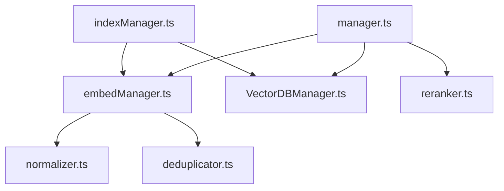

# Design Document: Embedding Quality Improvements

## Overview

This design covers six improvements to the Logseq Composer embedding pipeline that collectively improve retrieval quality. The changes touch three layers of the system:

1. **Content preparation** (normalization, deduplication) — cleans block content before it enters the chunking pipeline
2. **Chunking** (overlap, semantic-aware grouping) — produces higher-quality chunks that preserve context
3. **Embedding context** (graph-aware headers) — enriches chunk metadata with Logseq's link graph
4. **Retrieval** (RRF reranking) — combines vector similarity with keyword matching at query time

All six improvements are additive — they modify or extend existing functions in `src/embedManager.ts`, `src/VectorDBManager.ts`, and `src/manager.ts` without changing the Orama schema, the embedding API contract, or the plugin settings surface (beyond what's needed for configuration).

### Pipeline Order

The improved embedding pipeline processes each page in this order:

```
Page Block Tree
    │
    ▼
flattenBlocks()          ← existing: recursive flatten + ref resolution
    │
    ▼
normalizeBlockContent()  ← NEW (Req 6): strip markdown syntax
    │
    ▼
deduplicateBlocks()      ← NEW (Req 5): remove duplicate block lines
    │
    ▼
groupSemanticChunks()    ← MODIFIED (Req 2): heading-aware grouping
    │                      with overlap (Req 1)
    ▼
buildPageHeader()        ← MODIFIED (Req 3): add note_links, note_backlinks
    │
    ▼
useGenerateEmbedding()   ← existing: OpenAI API call
    │
    ▼
Orama insert             ← existing: store in vector DB
```

At query time:

```
User Query
    │
    ▼
useGenerateEmbedding()   ← existing: embed query
    │
    ▼
vectorSearchOramaDB()    ← existing: cosine similarity search
    │
    ▼
rerankWithRRF()          ← NEW (Req 4): keyword + vector rank fusion
    │
    ▼
Build LLM prompt         ← existing
```

## Architecture

### Module Responsibilities

The design keeps the existing file structure and adds new pure-function modules where possible:

| File | Changes |
|------|---------|
| `src/embedManager.ts` | Add `normalizeBlockContent()`, modify `buildPageHeader()` to accept link data, modify `groupBlocksIntoChunks()` for overlap + semantic grouping, add `extractOutgoingLinks()` |
| `src/deduplicator.ts` | **New file.** Exports `deduplicateBlocks()` — pure function, no Logseq API dependency |
| `src/normalizer.ts` | **New file.** Exports `normalizeBlockContent()` — pure function, regex-based |
| `src/reranker.ts` | **New file.** Exports `rerankWithRRF()` — pure function, no DB dependency |
| `src/manager.ts` | Modify `handleQuery()` to call `rerankWithRRF()` after vector search |
| `src/indexManager.ts` | Pass backlink data through to `getEmbeddingsForPage()` |

### Dependency Graph



All new modules (`normalizer.ts`, `deduplicator.ts`, `reranker.ts`) are pure functions with no external dependencies, making them straightforward to unit test and property test.

## Components and Interfaces

### 1. Normalizer (`src/normalizer.ts`)

Strips markdown formatting syntax from block content while preserving semantic text.

```typescript
/**
 * Strip markdown formatting from a single block line.
 * Preserves the semantic text content.
 */
export function normalizeBlockContent(content: string): string;
```

**Normalization rules (applied in order):**

| Rule | Pattern | Replacement | Example |
|------|---------|-------------|---------|
| Heading markers | `/^#{1,6}\s+/` | `""` | `## Foo` → `Foo` |
| Bold | `/\*\*(.+?)\*\*/g`, `/__(.+?)__/g` | `$1` | `**bold**` → `bold` |
| Italic | `/\*(.+?)\*/g`, `/_(.+?)_/g` | `$1` | `*italic*` → `italic` |
| Strikethrough | `/~~(.+?)~~/g` | `$1` | `~~struck~~` → `struck` |
| Highlight | `/==(.+?)==/g` | `$1` | `==hi==` → `hi` |
| Checkbox | `/^- \[[ xX]\]\s*/` | `"- "` | `- [x] done` → `- done` |
| Blockquote | `/^>\s*/` | `""` | `> quote` → `quote` |
| Inline code | `` /`([^`]+)`/g `` | `$1` | `` `code` `` → `code` |
| Page links | `/\[\[(.+?)\]\]/g` | `$1` | `[[page]]` → `page` |

**Ordering note:** Bold (`**`) must be processed before italic (`*`) to avoid partial matches. The page link rule preserves the link text since it carries semantic value.

### 2. Deduplicator (`src/deduplicator.ts`)

Removes duplicate block lines from the flattened block list before chunking.

```typescript
/**
 * Remove duplicate block lines from a flat list.
 * Keeps the first occurrence, removes subsequent duplicates.
 * Uses exact string matching on the resolved text content.
 */
export function deduplicateBlocks(blockLines: string[]): string[];

/**
 * Cross-page deduplication for full indexing.
 * Tracks seen content across multiple pages.
 */
export class CrossPageDeduplicator {
  /** Check if content was already seen. If not, mark it as seen. */
  tryAdd(content: string): boolean;
  /** Reset for a new indexing run. */
  clear(): void;
}
```

**Design decisions:**
- For incremental indexing (single page), `deduplicateBlocks()` deduplicates within the page's block lines only — no cross-page scan needed.
- For full indexing, `CrossPageDeduplicator` is instantiated once per run and passed through the batch loop. Each block line is checked against the global set before inclusion.
- Exact string matching is used (post-normalization) to keep the logic simple and deterministic.

### 3. Semantic-Aware Chunker (modifications to `groupBlocksIntoChunks()`)

The existing `groupBlocksIntoChunks()` function is extended with two new behaviors:

```typescript
export interface BlockLine {
  content: string;
  isHeading: boolean;
  depth: number;       // nesting depth (0 = top-level)
  groupId: number;     // semantic group ID (-1 if ungrouped)
}

/**
 * Identify semantic groups: a heading block + all its children.
 * Returns block lines annotated with group membership.
 */
export function identifySemanticGroups(blockLines: string[]): BlockLine[];

/**
 * Group block lines into chunks respecting semantic groups and overlap.
 * - Heading groups are kept together when possible.
 * - Overlap lines from the previous chunk are prepended to the next.
 */
export function groupBlocksIntoChunks(
  blockLines: BlockLine[],
  pageHeader: string,
  maxChunkChars: number,
  overlapFraction?: number  // default 0.15 (15%)
): string[];
```

**Overlap algorithm:**
1. After finalizing chunk N, compute `overlapCount = Math.ceil(blockLinesInChunkN.length * overlapFraction)`.
2. Cap overlap so it doesn't exceed 20% of `maxChunkChars`.
3. Prepend the last `overlapCount` block lines from chunk N to the start of chunk N+1 (before new content).
4. Single-chunk pages produce no overlap.

**Semantic grouping algorithm:**
1. Scan block lines for heading markers (`#` prefix after normalization context — note: grouping uses the *original* content before normalization, since normalization strips `#`).
2. A heading block and all subsequent blocks at deeper depth form a semantic group, until the next heading at the same or shallower depth.
3. If a semantic group fits in the current chunk, keep it together.
4. If it doesn't fit in the current chunk but fits in a fresh chunk, start a new chunk.
5. If it exceeds a single chunk, split between child blocks (never mid-block).
6. Non-heading blocks use the existing adjacency-based behavior.

### 4. Graph-Aware Page Header (modifications to `buildPageHeader()`)

```typescript
export interface PageLinkData {
  outgoingLinks: string[];   // page names from [[link]] syntax
  backlinks: string[];       // page names that link TO this page
}

/**
 * Extract outgoing page links from flattened block content.
 * Parses [[page_name]] patterns.
 */
export function extractOutgoingLinks(blockLines: string[]): string[];

/**
 * Fetch backlinks for a page using the Logseq API.
 */
export async function fetchBacklinks(pageName: string): Promise<string[]>;

/**
 * Build page header with optional graph context.
 */
export function buildPageHeader(
  pageId: string | number,
  pageName: string,
  properties?: Record<string, any>,
  linkData?: PageLinkData
): string;
```

**Header format (extended):**
```
note_id: 42
note_name: My Page
note_tags: tag1, tag2
note_links: Linked Page A, Linked Page B
note_backlinks: Referring Page X, Referring Page Y
note_content:

```

The `note_links` and `note_backlinks` fields are omitted when the respective arrays are empty.

### 5. RRF Reranker (`src/reranker.ts`)

```typescript
export interface SearchHit {
  id: string;
  content: string;
  score: number;        // original vector similarity score
}

export interface RankedHit extends SearchHit {
  rrfScore: number;
  keywordScore: number;
  vectorRank: number;
  keywordRank: number;
}

/**
 * Rerank search hits using Reciprocal Rank Fusion.
 * Combines vector similarity rank with keyword match rank.
 *
 * @param hits - Vector search results (already sorted by similarity)
 * @param query - Original user query string
 * @param k - RRF constant (default 60)
 * @param limit - Max results to return (default 5)
 */
export function rerankWithRRF(
  hits: SearchHit[],
  query: string,
  k?: number,
  limit?: number
): RankedHit[];
```

**Keyword scoring algorithm:**
1. Tokenize the query into terms (split on whitespace, lowercase).
2. For each hit, count how many query terms appear in `hit.content` (case-insensitive).
3. Rank hits by keyword score descending (ties broken by original vector rank).
4. Compute RRF: `rrfScore = 1/(k + vectorRank) + 1/(k + keywordRank)` where ranks are 1-indexed.
5. Sort by `rrfScore` descending, return top `limit` results.

## Data Models

### Existing Schema (unchanged)

The Orama vector database schema remains the same:

```typescript
{
  id: 'string',          // pageId or pageId_chunk_N
  lastUpdated: 'number', // page updatedAt timestamp
  content: 'string',     // chunk text (header + block lines)
  embedding: `vector[${dimensions}]`  // 1536 or 3072
}
```

No schema migration is needed. The content field will contain higher-quality text (normalized, deduplicated, with graph context in headers), but the shape is identical.

### New Internal Types

```typescript
// normalizer.ts — no new types, operates on strings

// deduplicator.ts
interface DeduplicationResult {
  deduplicated: string[];
  removedCount: number;
}

// embedManager.ts — BlockLine (see Components section above)
interface BlockLine {
  content: string;
  isHeading: boolean;
  depth: number;
  groupId: number;
}

// reranker.ts — SearchHit, RankedHit (see Components section above)
```

### Configuration Constants

| Constant | Value | Location | Description |
|----------|-------|----------|-------------|
| `OVERLAP_FRACTION` | `0.15` | `embedManager.ts` | Default overlap as fraction of previous chunk's block lines |
| `MAX_OVERLAP_BUDGET` | `0.20` | `embedManager.ts` | Max fraction of chunk char limit for overlap |
| `RRF_K` | `60` | `reranker.ts` | RRF smoothing constant |
| `RESULT_LIMIT` | `5` | `reranker.ts` | Max reranked results |

