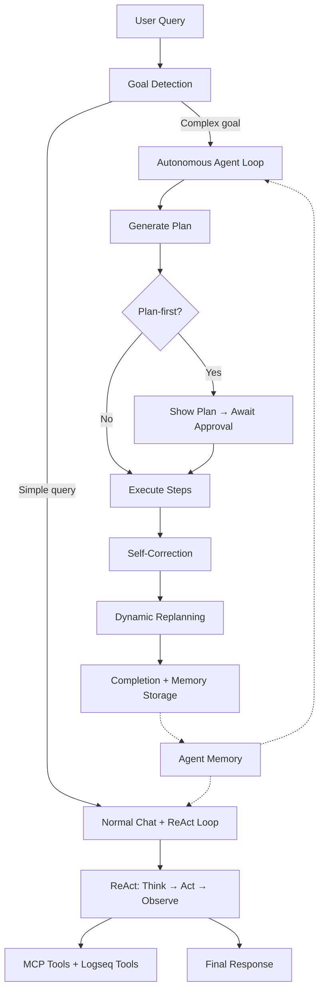

# Agentic AI System

This document describes the design and implementation of the Agentic AI capabilities in Logseq Mixer. The system transforms the plugin from a simple chat interface into an autonomous agent that remembers context across sessions, pursues multi-step goals, self-corrects its work, and iteratively chains tool calls to solve complex problems.

---

## Overview

The agentic system comprises four interconnected layers:



| Layer | Module | Purpose |
|---|---|---|
| **Memory** | `src/memory/` | Persistent context across sessions |
| **Goal Detection** | `src/agent/goalDetector.ts` | Routes queries to appropriate handler |
| **ReAct Loop** | `src/agent/ReActLoop.ts` | Iterative tool chaining with reasoning |
| **Agent Loop** | `src/agent/AgentLoop.ts` | Multi-step goal pursuit with planning |

---

## 1. Agent Memory

### Architecture

Memory is stored in two locations for complementary purposes:

| Storage | Purpose | Retrieval |
|---|---|---|
| SQLite `agent_memory` table | Fast structured queries, short-term working memory | Direct SQL lookups during prompt building |
| Logseq pages (`Mixer/Memory/*`) | Long-term knowledge, participates in RAG | Retrieved via hybrid vector+keyword search |

### SQLite Schema

```sql
CREATE TABLE IF NOT EXISTS agent_memory (
  id TEXT PRIMARY KEY,
  category TEXT NOT NULL,      -- 'preference', 'fact', 'task', 'session_summary', 'task_outcome'
  content TEXT NOT NULL,
  created_at INTEGER NOT NULL,
  last_accessed INTEGER,
  source TEXT,                 -- 'auto' or 'explicit'
  metadata TEXT
)
```

### Memory Categories

| Category | Trigger | Example |
|---|---|---|
| `preference` | User says "remember that I prefer..." | "User prefers bullet point format" |
| `fact` | User says "remember this..." (default) | "Project uses TypeScript with Stitches" |
| `task` | User mentions deadlines/todos | "Need to finish docs by Friday" |
| `session_summary` | Auto-generated on "New Session" | "Discussed chunking strategies..." |
| `task_outcome` | Auto-stored after agent goal completion | "Goal: organize notes. Result: completed 5/5 steps" |

### Memory Flow

```
User message → handleQuery() → Memory Injection (system prompt)
                                     ↓
                              LLM responds with memory-informed context
                                     ↓
                              detectExplicitMemory() → store if triggered
                                     ↓
                              "💾 Remembered" feedback (if stored)
```

### Memory Injection (Query Pipeline)

In `manager.ts`, before building the LLM messages:

1. Allocate `memoryBudgetPercent` (default 10%) of the context window
2. Retrieve: all `preference` memories + top-3 recent `session_summary` + keyword-matched `fact`/`task` entries
3. Deduplicate and format as a system prompt section
4. Truncate to budget using `truncateToTokens()`
5. Update `last_accessed` timestamps

### Auto-Summarization

When the user clicks "New Session" with 4+ messages:

1. Chat clears immediately (non-blocking UX)
2. Background: `sessionSummarizer.ts` calls LLM with summarization prompt
3. If meaningful: stores in SQLite + writes to `Mixer/Memory/Session-{timestamp}` page
4. If trivial (LLM returns "NOTHING_TO_REMEMBER"): skipped silently

### Logseq Page Structure

```
Mixer/Memory/
├── Session-2026-06-29-1200     (per-session summaries)
├── Session-2026-06-29-1430
├── Preferences                  (appended preference blocks)
└── Facts                        (appended fact blocks)
```

Each page uses Logseq properties:
```
type:: mixer-memory
category:: session_summary
created:: 2026-06-29
- User discussed implementing agentic memory
- Decision: use hybrid approach with SQLite + Logseq pages
```

### Configuration

| Setting | Default | Description |
|---|---|---|
| `memoryEnabled` | `true` | Toggle memory on/off (preserves data when disabled) |
| `autoSummarize` | `true` | Auto-summarize sessions on "New Session" |
| `memoryBudgetPercent` | `10` | Percentage of context window for memory (1-25) |

---

## 2. Goal Detection & Routing

### How It Works

`goalDetector.ts` determines whether a user message is a simple question or a complex multi-step goal:

```typescript
detectGoal(message: string, threshold = 0.6): { isGoal: boolean; confidence: number }
```

**Goal patterns** (increase confidence):
- Action verbs: "organize", "restructure", "consolidate", "create X from Y", "find all X and Y"
- Multi-step indicators: "then", "after that", "next", "finally", "and also"
- Long messages (>150 chars)
- Multiple conjunctions (2+ "and"/"then"/",")

**Question patterns** (decrease confidence):
- Starts with: "what", "who", "how", "explain", "is", "are"
- Ends with `?`
- Short messages (<100 chars)

### Routing Logic

```
User message
     ↓
agentMode === 'on'? ──No──→ Normal handleQuery()
     ↓ Yes
detectGoal(query, threshold)
     ↓
confidence >= threshold? ──No──→ Normal handleQuery()
     ↓ Yes
Return '__AGENT_GOAL_DETECTED__'
     ↓
App.tsx creates AgentLoop → generates plan → shows AgentProgress UI
```

### Configuration

| Setting | Default | Description |
|---|---|---|
| `agentMode` | `'on'` | `'on'` or `'off'` — master toggle for autonomous agent |
| `agentConfidenceThreshold` | `0.6` | Confidence threshold (0.0-1.0) for goal detection |

---

## 3. ReAct Loop (Iterative Tool Chaining)

### Concept

The ReAct pattern (Reason → Act → Observe) allows the LLM to iteratively call tools with explicit reasoning between calls until it has enough information to answer.

### Implementation

`ReActLoop.ts` provides:

```typescript
async function runReActLoop(messages: ChatMessage[], opts: ReActOptions): Promise<ReActResult>
```

### Loop Cycle

```
1. Send messages + tools to LLM
2. If response has tool_calls:
   a. Extract thought (assistant content before/alongside tool calls)
   b. Execute all tool calls (MCP + Logseq)
   c. Append results to messages
   d. Check: signal aborted? budget exceeded? max iterations?
   e. Call LLM again → goto 2
3. If response has text only (no tool_calls):
   → Loop ends, return final answer
```

### Available Tools

The ReAct loop merges two tool sources:

**MCP Tools** (external):
- Whatever SSE servers the user has configured
- File system, web search, databases, etc.

**Logseq Tools** (built-in, from `logseqTools.ts`):
| Tool | Description |
|---|---|
| `logseq_get_page` | Get page metadata by name |
| `logseq_get_blocks` | Get hierarchical block tree of a page |
| `logseq_search_pages` | Search pages by name substring |
| `logseq_insert_block` | Insert a block under a parent |
| `logseq_update_block` | Update block content |
| `logseq_create_page` | Create a new page |

### ReAct System Instruction

When tools are available, this is appended to the system prompt:

```
When using tools to solve problems:
1. THINK: Briefly reason about what information you need.
2. ACT: Call the appropriate tool(s).
3. OBSERVE: Analyze the results.
4. DECIDE: Either call more tools for additional information, or provide your final answer.
You may chain multiple tool calls iteratively until you have enough information to answer fully.
```

### Where ReAct Is Used

| Context | Max Iterations | Budget |
|---|---|---|
| Normal chat queries (`handleQuery`) | `agentMaxIterations` (25) | Unlimited |
| Agent step execution (tool/search type) | 10 | Remaining step budget |

### Configuration

| Setting | Default | Description |
|---|---|---|
| `agentMaxIterations` | `25` | Max tool call iterations per query |

---

## 4. Autonomous Agent Loop

### Architecture

`AgentLoop.ts` implements the full autonomous goal pursuit pipeline:

```
Goal → Plan → [Approve] → Execute Steps → Self-Correct → Replan → Complete
```

### Plan Generation

The agent sends the goal to the LLM with a planning system prompt that lists all available capabilities. The LLM returns structured JSON:

```json
{
  "steps": [
    { "id": 1, "description": "Search for project management pages", "type": "search" },
    { "id": 2, "description": "Read content from matched pages", "type": "read" },
    { "id": 3, "description": "Analyze and extract key points", "type": "think" },
    { "id": 4, "description": "Create summary page", "type": "write" }
  ],
  "estimatedTokens": 45000
}
```

### Step Types

| Type | Execution Method | Description |
|---|---|---|
| `read` | Logseq Editor API | Read pages, block trees |
| `write` | `blockExecutor.executeOne()` | Insert/update/delete blocks, create pages |
| `search` | ReAct loop (iterative) | Hybrid search with multi-tool chaining |
| `tool` | ReAct loop (iterative) | External MCP tool calls with chaining |
| `think` | Single LLM call | Analysis, reasoning, synthesis |

### Execution Flow

For each step:

```
1. Check budget → emit 'budget_warning' at 80%, stop at 100%
2. Check signal.aborted → emit 'aborted' if user clicked Stop
3. Emit 'step_start'
4. Execute step (with retry on failure):
   - If hard failure + retries < max: retry with adapted approach
   - If non-critical failure (read/search not found): skip
   - If max retries exceeded: escalate to user
5. Self-correction: evaluate output quality via LLM
   - If inadequate + corrections < max: re-execute with corrective context
6. Emit 'step_complete'
7. Every 2 steps: check if replanning is needed
```

### Self-Correction

After a step succeeds (API call worked), the agent evaluates output *quality*:

```
LLM Evaluation Prompt:
"Step intent: {description}. Output received: {output}. Was the intent achieved?"

Response: { "adequate": true/false, "reason": "...", "suggestion": "..." }
```

If inadequate:
- Increment `correctionAttempts`
- Store correction reason
- Emit `'self_correcting'` event
- Re-execute with suggestion as additional context

### Dynamic Replanning

Every 2 completed steps, the agent reviews progress:

```
LLM Replan Prompt:
"Goal: {goal}. Progress: {completed steps}. Remaining: {pending steps}. Should the plan change?"

Response: { "replan": true/false, "reason": "...", "newSteps": [...] }
```

If replanning is proposed:
- **Plan-first mode**: Pause, show proposed changes to user, await Accept/Reject
- **Autopilot mode**: Auto-approve, replace remaining steps

### Failure Handling

```
Step fails
     ↓
Is it read/search + "not found"? ──Yes──→ Skip (non-critical)
     ↓ No
Retries remaining? ──Yes──→ Ask LLM for alternative approach → Retry
     ↓ No
Escalate to user: show question + input field
     ↓
User provides guidance → Resume with guidance as context
```

### Configuration

| Setting | Default | Description |
|---|---|---|
| `agentAutonomy` | `'plan-first'` | `'plan-first'` (show plan for approval) or `'autopilot'` (execute immediately) |
| `agentTokenBudget` | `100000` | Max tokens per autonomous run (0 = unlimited) |
| `agentMaxRetries` | `2` | Retry attempts per step before escalating |
| `agentVerboseMode` | `false` | Show self-correction reasoning in progress UI |

---

## 5. UI Components

### Agent Mode Toggle

A violet toggle switch (🤖) in the toolbar. Persists to `agentMode` setting. When off, all goal detection is skipped.

### AgentProgress Component

Renders in the chat messages area when a goal is detected:

```
┌─────────────────────────────────────────────────┐
│ 🤖 Goal: Find all project pages and summarize  │
├─────────────────────────────────────────────────┤
│ ✅ 1. Search for project management pages       │
│ ✅ 2. Read content from matched pages           │
│    └─ Found 3 pages with relevant content       │
│ 🔄 3. Analyze and extract key points            │
│ ⏳ 4. Create summary page                       │
├─────────────────────────────────────────────────┤
│ ████████████░░░░ 3/4 steps                      │
│ ██████░░░░░░░░░░ 45K/100K tokens                │
├─────────────────────────────────────────────────┤
│ [⏹ Stop]                                        │
└─────────────────────────────────────────────────┘
```

**States:**
- Plan pending approval: shows [▶️ Approve] [✕ Cancel]
- Running: shows [⏹ Stop] with live step updates
- Escalation: shows question + textarea + [Submit]
- Replan proposed: shows diff of proposed changes + [✓ Accept] [✕ Keep Original]
- Verbose mode: shows ↩️ correction badges and reasoning on steps

### Memory Panel

Full management UI (🧠 button) for viewing, editing, and deleting stored memories. Category filter tabs, inline edit, delete with confirmation.

---

## 6. File Structure

```
src/agent/
├── types.ts           Type definitions (AgentPlan, AgentStep, StepResult, etc.)
├── AgentLoop.ts       Core agent: plan generation, step execution, self-correction, replanning
├── ReActLoop.ts       ReAct iterative tool chaining engine
├── goalDetector.ts    Pattern-based goal detection
└── logseqTools.ts     Logseq APIs as OpenAI-compatible tool definitions

src/memory/
├── MemoryStore.ts     CRUD on agent_memory SQLite table
├── memoryDetector.ts  Detects "remember this" trigger phrases
├── sessionSummarizer.ts  LLM-based session summarization
└── logseqMemoryWriter.ts  Writes memory pages to Logseq graph

src/components/
├── AgentProgress.tsx  Agent execution progress UI
├── AgentToggle.tsx    Agent mode toggle switch
└── MemoryPanel.tsx    Memory management panel
```

---

## 7. Data Flow Diagram

```
User types message
         ↓
┌─── handleQuery() ───────────────────────────────────────┐
│  1. Inject memories into system prompt                  │
│  2. Detect goal → route to agent OR continue            │
│  3. Build messages (system + history + context + query)  │
│  4. runReActLoop() with MCP + Logseq tools              │
│  5. Get final response                                  │
│  6. Detect "remember this" → store if triggered         │
│  7. Return response to UI                               │
└─────────────────────────────────────────────────────────┘
         ↓ (if goal detected)
┌─── AgentLoop ───────────────────────────────────────────┐
│  1. generatePlan() → structured steps                   │
│  2. Show plan (plan-first) or start (autopilot)         │
│  3. For each step:                                      │
│     a. Execute (ReAct for tool/search, single for rest) │
│     b. Self-correct if output inadequate                │
│     c. Replan every 2 steps if needed                   │
│  4. Store task_outcome in memory                        │
└─────────────────────────────────────────────────────────┘
```

---

## 8. Cost & Performance Considerations

| Operation | LLM Calls | Typical Tokens |
|---|---|---|
| Normal chat (no tools) | 1 | 1K-4K |
| Normal chat (with tool chaining) | 2-5 | 5K-20K |
| Agent: plan generation | 1 | 2K-5K |
| Agent: per step (read/write/think) | 1 | 1K-3K |
| Agent: per step (tool/search via ReAct) | 2-10 | 5K-30K |
| Agent: self-correction evaluation | 1 per step | 500-1K |
| Agent: replan check | 1 per 2 steps | 1K-3K |
| Session summarization | 1 | 1K-3K |

**Budget guidance:**
- Simple 3-step goal: ~15K-30K tokens
- Complex 7-step goal with corrections: ~50K-100K tokens
- Default budget of 100K tokens covers most real-world goals

---

## 9. Security & Safety

- **No redirect on page creation**: `redirect: false` prevents hijacking user navigation
- **AbortSignal propagation**: user can stop at any time via the Stop button
- **Budget enforcement**: hard limit prevents runaway token costs
- **Escalation**: agent asks for help rather than guessing when stuck
- **Memory persistence**: disabling memory doesn't delete data, only stops injection
- **Plan approval**: plan-first mode requires explicit user consent before execution
- **Replan approval**: plan changes pause for user confirmation (except autopilot)
