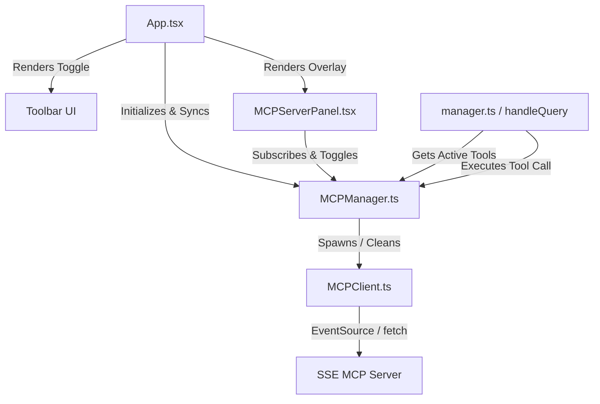

# Model Context Protocol (MCP) Integration

This document describes the design and implementation of Model Context Protocol (MCP) server support inside the Logseq Mixer plugin. This feature allows the AI assistant to dynamically call external tools exposed by local or remote MCP servers.

---

## Architectural Context: Browser Sandbox

Logseq plugins run inside sandboxed browser iframes. This sandbox imposes strict security constraints:
- Direct process spawning or standard input/output (stdio-based MCP transport) is **not possible** directly from within the browser sandbox.
- Consequently, this integration focuses on **Server-Sent Events (SSE)** based transport.

To use stdio-based servers (which are common in desktop tools), users can run a local **stdio-to-sse bridge proxy** (such as `mcp-sse-bridge` or `mcp-proxy`). The bridge runs locally as a process, connects to the stdio server, and exposes an HTTP/SSE endpoint that the Logseq plugin can connect to.

---

## Core Components

The MCP integration consists of several core modules located under `src/mcp/` and `src/components/`:



### 1. `MCPClient` (`src/mcp/MCPClient.ts`)
Represents an individual connection to an SSE-based MCP server.
- **Connection Lifecycle**:
  - Opens a native browser `EventSource` connection to the configured SSE URL.
  - Listens for the `endpoint` event sent by the server to determine the absolute HTTP POST message endpoint.
  - Sends a JSON-RPC `tools/list` request to discover available tools and cache their schemas.
- **Method Execution**:
  - Sends a JSON-RPC `tools/call` POST request to the message endpoint when executing a tool, returning a Promise that resolves when the response is received (either via the POST response body or asynchronously via the SSE message stream).

### 2. `MCPManager` (`src/mcp/MCPManager.ts`)
A singleton manager that coordinates multiple active `MCPClient` connections.
- **Settings Sync**: Automatically synchronizes connections on startup or settings updates, disconnecting removed servers and initializing connections to new ones.
- **Preference Persistence**: Persists tool enable/disable preferences in browser `localStorage` using the key `logseq-mixer:mcp-tools`.
- **Function Name Mapping**: Generates safe OpenAI-compatible function names matching `/^[a-zA-Z0-9_-]{1,64}$/`. If a generated name exceeds 64 characters, a hash is used to shorten it, and a reverse lookup cache is maintained.
- **Execution Routing**: Receives tool execution requests from the query runner and routes them to the correct client.

---

## Settings Configuration

The configuration is loaded from the plugin settings under the key `mcpServers`.

### Expected Formats

To accommodate standard configurations from other MCP clients (like Claude Desktop), the parser supports three formats:

#### Format A: Standard Key-Value Object Map (Recommended)
```json
{
  "filesystem": {
    "url": "http://localhost:3001/sse"
  },
  "git-tool": {
    "command": "npx",
    "args": ["@modelcontextprotocol/server-git"]
  }
}
```

#### Format B: Wrapped Object Map
Allows pasting an entire configuration file directly:
```json
{
  "mcpServers": {
    "filesystem": {
      "url": "http://localhost:3001/sse"
    }
  }
}
```

#### Format C: Array of Objects (Legacy)
```json
[
  {
    "name": "filesystem",
    "url": "http://localhost:3001/sse"
  }
]
```

### Stdio Configuration Handling
If a server configuration does not contain a `url` property (indicating a stdio-based server like `git-tool` in Format A), the `MCPClient` connection status is set to `'error'`, and a descriptive message is assigned to `errorMessage`:
> `"Stdio servers not supported in browser. Use an SSE bridge proxy."`

---

## User Interface (`src/components/MCPServerPanel.tsx`)

The UI provides an overlay panel to inspect and manage MCP connections:
- **Toggle Button**: A `🔌 MCP Servers` button is added in the toolbar row of the Chat Box.
- **Panel Listing**: Shows each configured server name and its current status:
  - `connected` (Green, online)
  - `connecting` (Amber, connecting)
  - `disconnected` (Grey, offline)
  - `error` (Red, failed or unsupported stdio server)
- **Tool Toggling**: Click a server card to expand it. Connected servers show their active tools count and allow toggling individual tools. Error-state servers display their full error message explaining why the connection failed (e.g. stdio process warning).

---

## LLM Integration & Tool Calling Loop

The integration with the LLM is handled in `src/manager.ts` inside the `handleQuery()` function:

1. **Retrieve Active Tools**: Before calling the LLM, `handleQuery` invokes `MCPManager.getInstance().getEnabledTools()` to fetch active, enabled tools formatted as OpenAI function tools.
2. **Execute Initial LLM Call**: The tools are passed to `queryLiteLLM()`.
3. **Intercept Tool Calls**:
   - If the model returns `tool_calls`, `handleQuery` enters a resolution loop.
   - For each tool call, it extracts parameters, parses arguments, and executes `MCPManager.getInstance().executeToolCall(name, args)`.
   - The assistant's tool-call request and the tool's execution result (wrapped in `role: 'tool'`) are appended to the chat message list.
4. **Re-query Loop**:
   - The model is queried again with the updated message list.
   - The loop continues recursively (up to a safety threshold of 10 loops) until the model decides to stop calling tools and outputs the final assistant text.
5. **Add to History**: The final text response is stored in `conversationHistory`.
