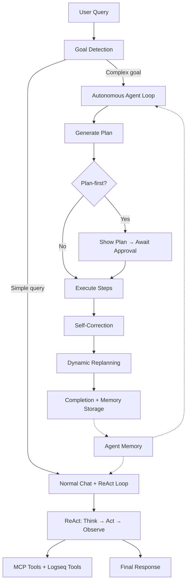

# Agent Internals

Implementation details of Logseq Mixer's autonomous agent system — memory architecture, goal detection, ReAct loop, self-correction, and dynamic replanning.

---

## Architecture Overview

The agent system comprises four interconnected layers:



| Layer | Module | Purpose |
|---|---|---|
| **Memory** | `src/memory/` | Persistent context across sessions |
| **Goal Detection** | `src/agent/goalDetector.ts` | Routes queries to appropriate handler |
| **ReAct Loop** | `src/agent/ReActLoop.ts` | Iterative tool chaining with reasoning |
| **Agent Loop** | `src/agent/AgentLoop.ts` | Multi-step goal pursuit with planning |

---

## 1. Memory System

### Dual Storage Architecture

| Storage | Purpose | Retrieval | Access Time |
|---|---|---|---|
| SQLite `agent_memory` table | Fast structured queries, working memory | Direct SQL lookups during prompt building | <1ms |
| Logseq pages (`Mixer/Memory/*`) | Long-term knowledge, RAG participation | Hybrid vector+keyword search | ~5ms |

### SQLite Schema

```sql
CREATE TABLE IF NOT EXISTS agent_memory (
  id TEXT PRIMARY KEY,
  category TEXT NOT NULL,      -- 'preference' | 'fact' | 'task' | 'session_summary' | 'task_outcome'
  content TEXT NOT NULL,
  created_at INTEGER NOT NULL,
  last_accessed INTEGER,
  source TEXT,                 -- 'auto' | 'explicit'
  metadata TEXT
)
```

### Memory Categories

| Category | Trigger | Example | Retention |
|---|---|---|---|
| `preference` | "prefer", "always", "never", "style" | "User prefers bullet points" | Permanent |
| `fact` | "remember this..." (default) | "Project uses TypeScript" | Permanent |
| `task` | "todo", "deadline", "need to" | "Finish docs by Friday" | Permanent |
| `session_summary` | Auto on "New Session" (4+ messages) | "Discussed chunking strategies" | Permanent |
| `task_outcome` | Auto after agent goal completion | "Goal: organize notes. 5/5 steps" | Permanent |

### Memory Injection Pipeline

In `manager.ts`, before building LLM messages:

```
1. Allocate memoryBudgetPercent (default 10%) of context window
2. Retrieve:
   - ALL preference memories
   - Top 3 recent session_summary entries
   - Keyword-matched fact/task entries against current query
3. Deduplicate by content hash
4. Format as system prompt section
5. Truncate to budget via truncateToTokens()
6. Update last_accessed timestamps
```

### Auto-Summarization

When user clicks "✨ New" with 4+ messages in history:

```
1. Chat clears immediately (non-blocking UX)
2. Background: sessionSummarizer.ts calls LLM with summarization prompt
3. LLM returns summary OR "NOTHING_TO_REMEMBER" (trivial conversations)
4. If meaningful:
   - Store in SQLite agent_memory (category: session_summary)
   - Write to Logseq page: Mixer/Memory/Session-{timestamp}
5. If trivial: skip silently
```

### Logseq Page Structure

```
Mixer/Memory/
├── Session-2026-06-29-1200     (per-session summaries)
├── Session-2026-06-29-1430
├── Preferences                  (appended preference blocks)
└── Facts                        (appended fact blocks)
```

Page format:
```
type:: mixer-memory
category:: session_summary
created:: 2026-06-29
- User discussed implementing agentic memory
- Decision: use hybrid approach with SQLite + Logseq pages
```

The `logseqMemoryWriter.ts` uses `splitIntoBlocks()` to split LLM-generated summaries into separate Logseq blocks. This function strips bullet markers (`- `, `* `, etc.) from the text since Logseq natively renders blocks as bullets — adding explicit markers would result in double-bulleted display.

### Configuration

| Setting | Default | Description |
|---|---|---|
| `memoryEnabled` | `true` | Toggle memory (preserves data when disabled) |
| `autoSummarize` | `true` | Auto-summarize on "New Session" |
| `memoryBudgetPercent` | `10` | Context window allocation (1-25%) |

---

## 2. Goal Detection

### Algorithm

`goalDetector.ts` uses a two-tier classification strategy:

**Primary: LLM-based classification**

The primary method sends a `CLASSIFICATION_PROMPT` to the model asking it to classify the user's message as either `'goal'` or `'query'`. Response parsing uses `\bgoal\b` and `\bquery\b` regex word-boundary matching to extract the classification — this handles verbose models that include explanation alongside their answer.

**Fallback: Regex-based detection (`detectGoalRegex`)**

When the LLM is unavailable (network error, timeout, etc.), the detector falls back to pattern-based scoring:

```typescript
detectGoalRegex(message: string, threshold = 0.6): { isGoal: boolean; confidence: number }
```

**Confidence boosters:**
- Action verbs: "organize", "restructure", "consolidate", "create X from Y", "find all X and Y"
- Multi-step indicators: "then", "after that", "next", "finally", "and also"
- Long messages (>150 chars)
- Multiple conjunctions (2+ "and"/"then"/",")

**Confidence reducers:**
- Starts with: "what", "who", "how", "explain", "is", "are"
- Ends with `?`
- Short messages (<100 chars)

### SINGLE_ACTION_PATTERNS

Before classification runs, the message is checked against `SINGLE_ACTION_PATTERNS` — a set of regex patterns that match simple write/edit requests (e.g., "write X", "edit Y", "add a block"). These are filtered out from triggering the agent, since they are better served by the direct edit pipeline or a single ReAct tool call rather than a multi-step plan.

### Routing Logic

```
User message
     ↓
agentMode === 'on'? ──No──→ Normal handleQuery()
     ↓ Yes
detectGoal(query, threshold)
     ↓
confidence >= threshold? ──No──→ Normal handleQuery()
     ↓ Yes
Return '__AGENT_GOAL_DETECTED__'
     ↓
App.tsx creates AgentLoop → Plan → Execute → Complete
```

---

## 3. ReAct Loop

### Implementation

`ReActLoop.ts` provides iterative tool chaining with explicit reasoning:

```typescript
async function runReActLoop(messages: ChatMessage[], opts: ReActOptions): Promise<ReActResult>
```

### Loop Cycle

```
1. Send messages + tool definitions to LLM
2. If response contains tool_calls:
   a. Extract reasoning (assistant content alongside tool calls)
   b. Execute all tool calls (MCP + Logseq tools in parallel)
   c. Append tool results to message history
   d. Check abort conditions: signal.aborted? budget exceeded? max iterations?
   e. If no abort → query LLM again → goto 2
3. If response is text only (no tool_calls):
   → Loop ends, return final text as answer
```

### System Instruction (Appended When Tools Available)

```
When using tools to solve problems:
1. THINK: Briefly reason about what information you need.
2. ACT: Call the appropriate tool(s).
3. OBSERVE: Analyze the results.
4. DECIDE: Either call more tools for additional information, or provide your final answer.
You may chain multiple tool calls iteratively until you have enough information to answer fully.
```

### Available Tools

**Built-in Logseq tools** (from `logseqTools.ts`):

| Tool | Description | Requires Write |
|---|---|---|
| `logseq_get_page` | Get page metadata by name | No |
| `logseq_get_blocks` | Get hierarchical block tree of a page | No |
| `logseq_search_pages` | Search pages by name substring | No |
| `logseq_insert_block` | Insert a block under a parent | Yes |
| `logseq_update_block` | Update block content | Yes |
| `logseq_create_page` | Create a new page | Yes |

**Write tool gating:** Write tools (`logseq_insert_block`, `logseq_update_block`, `logseq_create_page`) are only included when `includeLogseqWriteTools` is `true`. In normal chat mode with Direct Page Edit off, only read-only Logseq tools are available to the ReAct loop. The agent loop always gets full write access regardless of the edit toggle.

**MCP tools** (external): Whatever SSE servers the user has configured — dynamically discovered at connection time.

### Usage Contexts

| Context | Max Iterations | Budget |
|---|---|---|
| Normal chat (`handleQuery`) | `agentMaxIterations` (default 25) | Unlimited |
| Agent step execution (tool/search type) | 10 | Remaining step budget |

### Streaming Support

When `streamingEnabled` is `true` (plugin setting: **Streaming Responses**), the ReAct loop uses `queryLiteLLMStreaming()` to progressively deliver the final answer:

- **No tools available** (simple Q&A): The initial LLM call streams directly to the UI via `onChunk`.
- **Tools available** (iterative loop): Intermediate tool-calling iterations use streaming internally but buffer chunks. Only when the final response arrives (no more `tool_calls`), the buffered chunks are flushed to the UI, providing a streaming UX for the final answer.
- **Edit mode**: Streaming is always disabled because edit commands require complete parsing before execution.

The `queryLiteLLMStreaming()` function handles all three providers:
- **OpenAI / LiteLLM**: SSE format (`text/event-stream`) with `data: {...}` lines containing `choices[0].delta.content` chunks and optional `tool_calls` accumulation.
- **Ollama**: NDJSON format with `message.content` chunks per line.
- **Fallback**: If the provider ignores `stream: true` and returns a plain JSON body, the function detects this from the `Content-Type` header and delivers the full content as a single chunk.

---

## 4. Agent Loop

### Architecture

`AgentLoop.ts` implements the full autonomous pipeline:

```
Goal → Plan → [Approve] → Execute Steps → Self-Correct → Replan → Complete
```

### Plan Generation

The LLM receives the goal + available capabilities and returns structured JSON:

```json
{
  "steps": [
    { "id": 1, "description": "Search for project management pages", "type": "search" },
    { "id": 2, "description": "Read content from matched pages", "type": "read" },
    { "id": 3, "description": "Analyze and extract key points", "type": "think" },
    { "id": 4, "description": "Create summary page", "type": "write" }
  ],
  "estimatedTokens": 45000
}
```

### Step Types

| Type | Execution Method | Description |
|---|---|---|
| `read` | Logseq Editor API | Read a single page's block tree |
| `write` | `blockExecutor.executeOne()` | Insert/update/delete blocks, create pages |
| `search` | ReAct loop (iterative, max 10) | Hybrid search with multi-tool chaining |
| `tool` | ReAct loop (iterative, max 10) | External MCP tool calls with chaining |
| `think` | Single LLM call | Analysis, reasoning, synthesis |
| `gather` | Map-Reduce pipeline | Batch-read multiple pages with per-batch summarization |
| `specialist` | Isolated LLM call | Focused sub-task with targeted input — no accumulated context noise |

### Context Compression Layer

#### Problem

As the agent executes steps sequentially, `previousOutputs` accumulates all step outputs. By step 5+, the context injected into the next step can be 10K–20K tokens of raw accumulated output. This causes:

- **Attention degradation** — "lost in the middle" where the LLM ignores information buried in long context
- **Wasted tokens** — redundant information repeated across steps
- **Poor output quality** — later steps (especially synthesis/write) produce worse results

#### Solution: Adaptive Compression

After each successful step, `compressContext()` checks if accumulated context exceeds a threshold (4000 tokens). If exceeded, a lightweight LLM call compresses all `previousOutputs` into a concise "working memory":

```
Step 1 output: "Found 7 pages matching 'machine learning': ML Basics, Neural Nets, ..."  (800 tokens)
Step 2 output: "Gathered data from ML Basics: ...definitions, ...concepts, ..."          (2000 tokens)
Step 3 output: "Gathered data from Neural Nets: ...architectures, ...training, ..."      (2500 tokens)
                                                                              Total: 5300 tokens
                                                                                    ↓
                                                                         COMPRESSION TRIGGERED
                                                                                    ↓
Compressed working memory: "7 ML pages found. Key data extracted:                   (1800 tokens)
  - ML Basics: supervised/unsupervised learning, regression, classification
  - Neural Nets: CNN, RNN, Transformer architectures, backprop, SGD
  Pages: ML Basics, Neural Nets, Transformers, Deep Learning, ..."
```

#### Compression Rules

The compression prompt instructs the LLM to:
- **Preserve** all factual data: names, UUIDs, page names, block content, search results, numbers, dates
- **Preserve** the logical sequence of what was done and discovered
- **Remove** redundancy, verbose explanations, repeated content
- **Keep** extracted data verbatim (never paraphrase page names, UUIDs, or content)
- **Target** 30-50% of original length while retaining all key information

#### When Compression Fires

| Condition | Behavior |
|---|---|
| Accumulated tokens < 4000 | No compression (overhead not worth it) |
| Accumulated tokens ≥ 4000 | Compress and replace `previousOutputs` |
| Compressed result > 80% of original | Reject compression (not effective enough) |
| Compression LLM call fails | Continue with uncompressed context (graceful fallback) |
| Last step in plan | Skip compression (final synthesis handles its own context) |

#### Cost

One additional LLM call per compression event (typically 1-2 per goal run). The tokens saved downstream far exceed the compression cost because every subsequent step receives a smaller, focused context.

### Specialist Step Type

#### Problem

Even with compression, some tasks inherently need high-quality output from a clean slate — particularly final synthesis, comparison, and complex analysis. A "think" step still receives the accumulated (possibly compressed) context, which may include irrelevant data from prior steps.

#### Solution: Isolated Execution

The `specialist` step executes with its own fresh LLM call that receives **only targeted input** — not the full accumulated context. This gives the specialist the full attention span of the model on just the relevant data.

#### How It Works

```
┌─────────────────────────────────────────────────────────────────┐
│                     SPECIALIST STEP EXECUTION                    │
├─────────────────────────────────────────────────────────────────┤
│                                                                  │
│  Step definition:                                                │
│    { "type": "specialist",                                       │
│      "description": "Create comparison table of ML algorithms",  │
│      "specialistRole": "You are a technical writer...",          │
│      "inputSteps": [2, 3] }                                     │
│                                                                  │
│  Execution:                                                      │
│    1. Collect outputs ONLY from inputSteps [2, 3]               │
│    2. Include scratchPad data (from gather steps)                │
│    3. Build fresh messages:                                      │
│       - system: specialistRole + production rules               │
│       - user: goal + task description + targeted input only     │
│    4. Single LLM call (no accumulated context noise)            │
│    5. Store output in scratchPad["specialist_step_{id}"]        │
│    6. Return output for step completion                         │
│                                                                  │
└─────────────────────────────────────────────────────────────────┘
```

#### Plan JSON Format

```json
{
  "steps": [
    { "id": 1, "type": "search", "description": "Find React and Vue pages" },
    { "id": 2, "type": "gather", "description": "Extract React concepts and patterns" },
    { "id": 3, "type": "gather", "description": "Extract Vue concepts and patterns" },
    { "id": 4, "type": "specialist",
      "description": "Create a detailed comparison table: React vs Vue",
      "specialistRole": "You are a frontend framework expert. Create comprehensive, well-structured markdown comparison tables.",
      "inputSteps": [2, 3] }
  ]
}
```

Step 4 receives **only** the gather outputs from steps 2 and 3 — not the search results from step 1, not any accumulated noise.

#### Fields

| Field | Required | Description |
|---|---|---|
| `specialistRole` | Optional | Custom system prompt for the specialist. Defaults to a generic production prompt. |
| `inputSteps` | Optional | Array of step IDs whose outputs to include as input. If empty, includes scratchPad data and a brief summary of prior steps. |

#### Input Data Assembly

Priority order for specialist input:
1. **Specified step outputs** — full text from `inputSteps` IDs
2. **ScratchPad data** — all gathered/specialist data (up to 40% of context window)
3. **Fallback** — if nothing specified, brief summaries of all prior steps (200 chars each)

#### When the Planner Uses Specialist

The planning prompt instructs the LLM to use `specialist` when:
- Final synthesis/output step that combines data from multiple prior steps
- Task requires high-quality output that would be degraded by large accumulated context
- Complex analysis, comparison, or writing where focused attention matters
- Pattern: `search` → `gather` → **`specialist`** (find, process, synthesize with clean context)

#### Specialist vs Think

| Aspect | `think` | `specialist` |
|---|---|---|
| Context | Receives accumulated `previousOutputs` + `scratchPad` | Receives **only** specified `inputSteps` + `scratchPad` |
| System prompt | Generic step execution prompt | Custom `specialistRole` prompt |
| Best for | Quick reasoning, intermediate analysis | Final synthesis, comparison, complex writing |
| Context noise | High (grows with each step) | Minimal (only what's needed) |
| Output storage | `previousOutputs` | `previousOutputs` + `scratchPad` |

### Execution Flow

For each step:

```
1. Check budget → emit 'budget_warning' at 80%, stop at 100%
2. Check signal.aborted → emit 'aborted' if user clicked Stop
3. Emit 'step_start'
4. Execute step (with retry on failure):
   - Hard failure + retries remaining → retry with adapted approach
   - Non-critical failure (read/search returns empty) → skip
   - Max retries exceeded → escalate to user
5. Self-correction: evaluate output quality via LLM
   - If inadequate + corrections remaining → re-execute with corrective context
6. Emit 'step_complete'
7. Every 2 steps: check if replanning is needed
```

### Self-Correction

After a step succeeds (API call worked), the agent evaluates output *quality*:

```
LLM Evaluation Prompt:
"Step intent: {description}. Output received: {output}. Was the intent achieved?"

Response: { "adequate": true/false, "reason": "...", "suggestion": "..." }
```

If inadequate:
1. Increment `correctionAttempts`
2. Store correction reason
3. Emit `'self_correcting'` event
4. Re-execute step with suggestion as additional context
5. Re-evaluate

### Dynamic Replanning

Every 2 completed steps:

```
LLM Replan Prompt:
"Goal: {goal}. Progress: {completed steps}. Remaining: {pending steps}.
 Should the plan change?"

Response: { "replan": true/false, "reason": "...", "newSteps": [...] }
```

Behavior:
- **Plan-first mode:** Pause, show proposed changes, await Accept/Reject
- **Autopilot mode:** Auto-approve, replace remaining steps

### Failure Handling

```
Step fails
     ↓
Is it read/search + "not found"? ──Yes──→ Skip (non-critical)
     ↓ No
Retries remaining? ──Yes──→ Ask LLM for alternative approach → Retry
     ↓ No
Diagnose failure via LLM:
  - WHAT failed (plain language)
  - WHY it likely failed (root cause)
  - SUGGESTION (actionable fix)
     ↓
Escalate to user:
  - Show diagnostic + question + input field
  - User provides guidance
  - Resume with guidance as context
```

### Failure Diagnostics

When a step exhausts retries or escalates, the agent calls `diagnoseFailure()` which makes a lightweight LLM call to translate raw errors into human-readable explanations. This replaces cryptic messages like `"LLM request failed: 429"` with contextual analysis:

```
WHAT: The block insertion into "ML Overview" failed.
WHY: The target parent block UUID doesn't exist — the page may not
     have been created in a prior step.
SUGGESTION: Run the page creation step first, then re-read the page
            to get valid block UUIDs.
```

The diagnostic is shown in:
- The `step_failed` progress event (visible in the AgentProgress UI)
- The escalation prompt sent to the user
- The step's `error` field (persisted on the AgentStep object)

If the diagnostic LLM call itself fails (e.g., network down), it falls back to the raw error string.

---

## 5. Map-Reduce Gather Pipeline

### Problem

LLMs have a fixed context window, but knowledge graphs can contain hundreds of pages. A naive approach (read all pages → pass to LLM) fails when the combined content exceeds the model's limit. Even within limits, attention quality degrades as context grows.

### Solution: Batched Map-Reduce

The `gather` step type implements a Map-Reduce pattern that processes arbitrarily many pages without losing information:

```
┌─────────────────────────────────────────────────────────────────────┐
│                        GATHER STEP EXECUTION                         │
├─────────────────────────────────────────────────────────────────────┤
│                                                                      │
│  Prior step outputs (e.g., search results: "page1, page2, ... pageN")│
│         ↓                                                            │
│  LLM extracts page names from context → ["page1", ..., "pageN"]     │
│         ↓                                                            │
│  ┌── MAP PHASE ──────────────────────────────────────────────────┐  │
│  │                                                                │  │
│  │  Batch 1: [page1, page2, page3]                               │  │
│  │    → Read all blocks (recursive, with children)               │  │
│  │    → Truncate to 50% of model context limit                   │  │
│  │    → LLM summarizes: extract relevant info for the goal       │  │
│  │    → Store summary                                            │  │
│  │                                                                │  │
│  │  Batch 2: [page4, page5, page6]                               │  │
│  │    → (same)                                                    │  │
│  │                                                                │  │
│  │  ...                                                           │  │
│  │                                                                │  │
│  │  Batch N: [page(N-2), page(N-1), pageN]                       │  │
│  │    → (same)                                                    │  │
│  │                                                                │  │
│  └────────────────────────────────────────────────────────────────┘  │
│         ↓                                                            │
│  All batch summaries → scratchPad["gather_step_{id}"]                │
│         ↓                                                            │
│  ┌── REDUCE PHASE (in subsequent think step or final synthesis) ──┐  │
│  │                                                                 │  │
│  │  scratchPad data injected into context (up to 50% budget)      │  │
│  │  → LLM synthesizes all gathered information into deliverable   │  │
│  │                                                                 │  │
│  └─────────────────────────────────────────────────────────────────┘  │
│                                                                      │
└─────────────────────────────────────────────────────────────────────┘
```

### Working Memory (ScratchPad)

The `scratchPad` is a `Map<string, string>` on `StepContext` that persists across the entire agent run. Unlike `previousOutputs` (which are truncated when passed to subsequent steps), scratchPad data is preserved at full fidelity and injected with generous budget allocation.

**Key properties:**
- Not subject to per-step output truncation (1K–8K chars)
- Available to ALL subsequent steps (think, write, tool, search)
- Allocated up to 30% of context budget in step execution, 50% in final synthesis
- Keyed by `gather_step_{id}` — multiple gather steps accumulate additively

### Dynamic Context Scaling

Context pass-through limits scale with the model's context window:

| Model | Context Window | Step Output Limit | Prior Steps Visible | ScratchPad Budget (step) | ScratchPad Budget (synthesis) |
|---|---|---|---|---|---|
| GPT-3.5 Turbo | 16K | 1.6K / 4.8K | 5 | 4.8K | 8K |
| GPT-4o | 128K | 8K* / 30K* | 12 | 38.4K | 64K |
| Claude 3.5 | 200K | 8K* / 30K* | 20 | 60K | 100K |

*Capped at 8K (normal) / 30K (last think step) to avoid diminishing returns.

### Batch Size

Fixed at 3 pages per batch. This balances:
- **Quality**: Each batch gets the LLM's full attention on just 3 pages
- **Coverage**: Even 30 pages complete in only 10 batches
- **Budget**: Each batch uses one LLM call (~2K–5K tokens)

### When the Planner Uses Gather

The planning prompt instructs the LLM to use `gather` when:
- Goal involves processing more than 3 pages
- Goal uses phrases like "find all X and extract Y", "summarize notes on Z"
- Pattern: `search` → `gather` → `think` (find pages, process them, produce output)

### Example Plan

```json
{
  "steps": [
    { "id": 1, "description": "Search for all pages related to machine learning", "type": "search" },
    { "id": 2, "description": "Gather all ML pages and extract key concepts, definitions, and relationships", "type": "gather" },
    { "id": 3, "description": "Synthesize extracted data into a structured overview with categories", "type": "think" },
    { "id": 4, "description": "Create the ML Overview page with the structured content", "type": "write" }
  ],
  "estimatedTokens": 60000
}
```

### Abort Conditions

The gather loop stops early if:
- `signal.aborted` (user clicked Stop)
- Token budget exhausted (`tokensUsed + totalTokens >= tokenBudget`)

---

## 5. UI Components

### AgentProgress

Renders in chat messages area during goal execution:

**States:**
- **Plan pending:** Shows [▶️ Approve] [✕ Cancel]
- **Running:** Shows [⏹ Stop] with live step updates
- **Escalation:** Shows question + textarea + [Submit]
- **Replan proposed:** Shows diff of proposed changes + [✓ Accept] [✕ Keep Original]
- **Verbose mode (default ON, 📋 toolbar toggle):** Shows color-coded type badges per step, per-step token usage, ↩ correction badges with reasoning, and detailed error messages for failed steps

### Memory Panel (🧠 button)

Full management UI:
- Category filter tabs (All, Preferences, Facts, Sessions, Tasks)
- Inline edit (✏️)
- Delete with confirmation (🗑️)
- Clear All with confirmation

---

## 6. File Structure

```
src/agent/
├── types.ts           AgentPlan, AgentStep, StepResult, StepType
├── AgentLoop.ts       Plan generation, step execution, self-correction, replanning
├── ReActLoop.ts       Iterative tool chaining engine
├── goalDetector.ts    LLM-based goal classification with regex fallback
└── logseqTools.ts     Logseq APIs as OpenAI-compatible function tool schemas

src/memory/
├── MemoryStore.ts     CRUD on agent_memory SQLite table
├── memoryDetector.ts  Detects "remember this" trigger phrases
├── sessionSummarizer.ts  LLM-based session summarization
└── logseqMemoryWriter.ts  Writes memory pages to Logseq graph

src/components/
├── AgentProgress.tsx  Agent execution progress UI with step states
├── AgentToggle.tsx    Agent mode toggle switch (violet)
└── MemoryPanel.tsx    Memory management panel with CRUD
```

---

## 7. Data Flow

```
User types message
         ↓
┌─── handleQuery() ───────────────────────────────────────┐
│  1. Inject memories into system prompt                  │
│  2. Detect goal → route to agent OR continue            │
│  3. Build messages (system + history + context + query)  │
│  4. runReActLoop() with MCP + Logseq tools              │
│  5. Get final response                                  │
│  6. Detect "remember this" → store if triggered         │
│  7. Return response to UI                               │
└─────────────────────────────────────────────────────────┘
         ↓ (if goal detected)
┌─── AgentLoop ───────────────────────────────────────────┐
│  1. generatePlan() → structured steps                   │
│  2. Show plan (plan-first) or start (autopilot)         │
│  3. For each step:                                      │
│     a. Execute:                                         │
│        - gather → Map-Reduce → scratchPad               │
│        - specialist → isolated LLM call → scratchPad    │
│        - tool/search → ReAct loop                       │
│        - read/write/think → single LLM + action         │
│     b. Self-correct if output inadequate                │
│     c. Compress context if threshold exceeded           │
│     d. Replan every 2 steps if needed                   │
│  4. synthesizeFinalAnswer() using scratchPad + outputs  │
│  5. Store task_outcome in memory                        │
└─────────────────────────────────────────────────────────┘
```

---

## 8. Cost & Performance

| Operation | LLM Calls | Typical Tokens |
|---|---|---|
| Normal chat (no tools) | 1 | 1K–4K |
| Normal chat (with tool chaining) | 2–5 | 5K–20K |
| Agent: plan generation | 1 | 2K–5K |
| Agent: per step (read/write/think) | 1 | 1K–3K |
| Agent: per step (tool/search via ReAct) | 2–10 | 5K–30K |
| Agent: per step (specialist) | 1 | 2K–8K |
| Agent: gather step (per batch of 3 pages) | 1 | 2K–5K |
| Agent: gather step (10 pages total) | 5 (1 extract + 4 batches) | 15K–30K |
| Agent: context compression | 1 (per trigger) | 1K–3K |
| Agent: self-correction evaluation | 1 per step | 500–1K |
| Agent: replan check | 1 per 2 steps | 1K–3K |
| Agent: final synthesis | 1 | 3K–10K |
| Session summarization | 1 | 1K–3K |

**Budget guidance:**
- Simple 3-step goal: ~15K–30K tokens
- Complex 7-step goal with corrections: ~50K–100K tokens
- Multi-page gather (20 pages): ~40K–60K tokens
- Default budget (100K) covers most real-world goals

---

## 9. Security & Safety

| Safeguard | Implementation |
|---|---|
| **No navigation hijack** | `redirect: false` on all page creation calls |
| **AbortSignal propagation** | User Stop button → signal.abort() → all pending operations cancelled |
| **Budget enforcement** | Hard token limit per goal (emits warning at 80%) |
| **MCP tool timeout** | Configurable per-call timeout (default 180s) prevents indefinite hangs on unresponsive tools |
| **Escalation over guessing** | Agent asks user for guidance when stuck (never guesses on critical paths) |
| **Failure diagnostics** | LLM-powered root cause analysis before escalating, so the user gets actionable context |
| **Memory persistence** | Disabling memory stops injection, doesn't delete stored data |
| **Plan approval** | Plan-first mode requires explicit consent before execution |
| **Replan approval** | Plan changes pause for user confirmation (except autopilot) |
| **Retry cap** | Max retries per step prevents infinite loops |

---

## Related Documentation

- [Architecture](https://github.com/indraginanjar/logseq-mixer/blob/main/docs/technical/architecture.md) — System overview and module map
- [MCP Protocol](https://github.com/indraginanjar/logseq-mixer/blob/main/docs/technical/mcp-protocol.md) — How MCP tools integrate with the agent
- [Agentic AI (User Guide)](https://github.com/indraginanjar/logseq-mixer/blob/main/docs/user/agentic-ai.md) — User-facing capabilities and configuration
