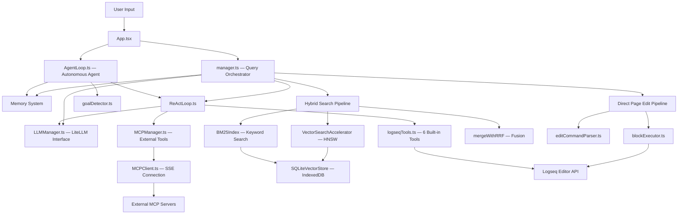
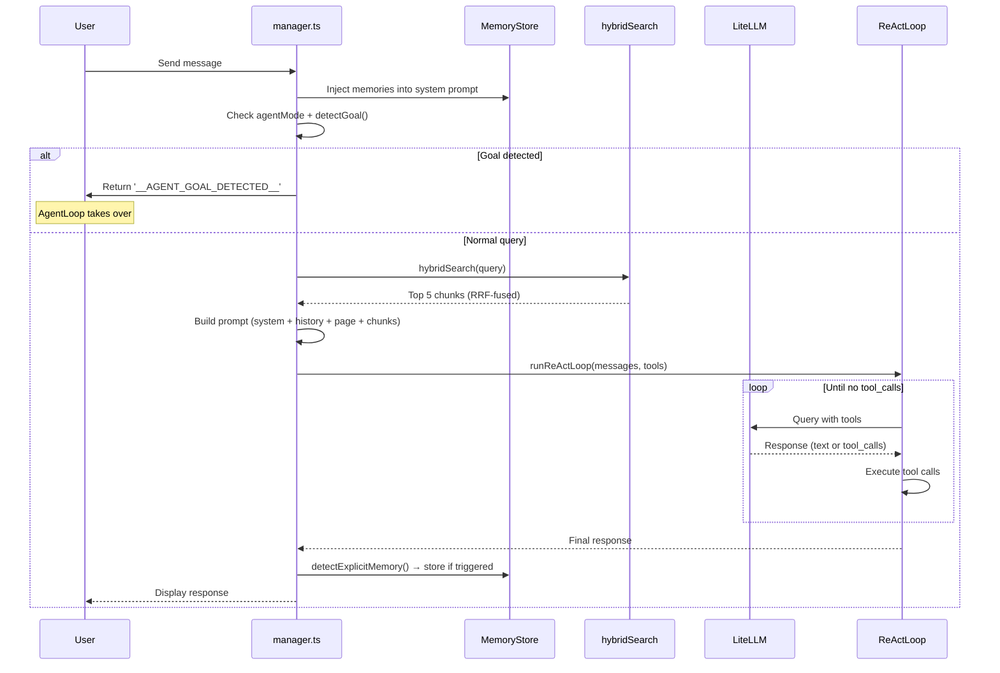
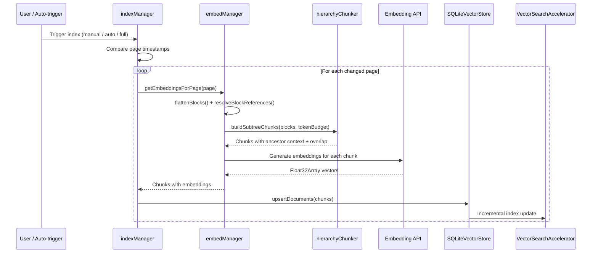

# Architecture

High-level system architecture of Logseq Mixer — module relationships, data flow, and key design decisions.

---

## System Overview



---

## Module Map

```
src/
├── main.tsx                    Plugin entry point, lazy initialization
├── App.tsx                     React root, state management, UI orchestration
├── manager.ts                  Query orchestrator (handleQuery, indexing, auto-embed)
├── LLMManager.ts               LLM communication (OpenAI, Ollama, LiteLLM), model token limits, dynamic model discovery, max_tokens parameter negotiation, streaming SSE support
│
├── agent/
│   ├── AgentLoop.ts            Multi-step goal execution with self-correction, sub-goals, and memory
│   ├── ReActLoop.ts            Iterative tool chaining (Reason → Act → Observe)
│   ├── goalDetector.ts         LLM-based goal classification with regex fallback
│   ├── logseqTools.ts          Built-in Logseq tools as OpenAI function schemas
│   ├── types.ts                AgentPlan, AgentStep, StepResult, StepOutput types
│   ├── modelRouter.ts          Per-step model routing (fast/quality/explicit)
│   ├── executionGraph.ts       Topological wave grouping for parallel step execution
│   └── outputParser.ts         Structured output parsing (JSON extraction, metadata detection)
│
├── memory/
│   ├── MemoryStore.ts          CRUD on agent_memory SQLite table
│   ├── memoryDetector.ts       "Remember this" trigger phrase detection
│   ├── sessionSummarizer.ts    LLM-based conversation summarization
│   └── logseqMemoryWriter.ts   Writes memory to Logseq graph pages
│
├── mcp/
│   ├── MCPClient.ts            Individual SSE connection to an MCP server
│   └── MCPManager.ts           Singleton coordinator for multiple MCP clients
│
├── storage/
│   ├── SQLiteVectorStore.ts    Per-document SQLite storage with IndexedDB persistence
│   ├── VectorSearchAccelerator.ts  In-memory HNSW index (hnswlib-wasm)
│   ├── VectorSearchAccelerator.types.ts  HNSW configuration
│   ├── cosineSimilarity.ts     Embedding BLOB encode/decode, cosine similarity
│   ├── StorageProvider.ts      Storage interface (per-document + legacy)
│   ├── createStorageProvider.ts  Factory: SQLite vs Settings backend
│   └── migrateLegacy.ts        Migration from legacy Orama to SQLite
│
├── embedManager.ts             Block flattening, reference resolution, chunking, embedding
├── indexManager.ts             Incremental indexing, auto-index on change
├── hierarchyChunker.ts         Subtree-based chunking with ancestor context
├── bm25Index.ts                In-memory BM25 inverted index
├── queryClassifier.ts          Query classification (keyword/semantic/mixed)
├── hybridSearch.ts             Hybrid search orchestration
├── reranker.ts                 RRF fusion (mergeWithRRF, rerankWithRRF)
├── tokenizer.ts                Lazy-loaded cl100k_base tokenizer
│
├── editPromptBuilder.ts        Direct Page Edit system prompt + page context formatting
├── editCommandParser.ts        Extracts edit commands from LLM json-edit blocks
├── blockExecutor.ts            Executes edit commands via Logseq API
├── blockTreeFormatter.ts       Formats page block trees with UUIDs
├── blockRefParser.ts           ((uuid)) → clickable link transformation
│
├── cooldownManager.ts          Re-index cooldown timer
├── buttonState.ts              Re-index button state derivation
├── settings.ts                 Plugin settings schema
│
├── components/
│   ├── AgentProgress.tsx       Agent execution progress UI
│   ├── AgentToggle.tsx         Agent mode toggle
│   ├── MemoryPanel.tsx         Memory management UI
│   ├── MCPServerPanel.tsx      MCP server management UI
│   ├── AutoEmbedToggle.tsx     Auto-embed toggle
│   ├── BlockLink.tsx           Clickable block reference component
│   └── ChatMessageList.tsx     Chat rendering with link transformation
│
└── types/
    └── editTypes.ts            Edit command TypeScript types
```

---

## Data Flow: Query Pipeline



---

## Data Flow: Indexing Pipeline



---

## Storage Layer

| Component | Technology | Purpose | Persistence |
|---|---|---|---|
| **SQLiteVectorStore** | sql.js (WASM) | Document chunks, embeddings, block metadata | IndexedDB (binary ArrayBuffer) |
| **VectorSearchAccelerator** | hnswlib-wasm | Fast approximate nearest neighbor search | Volatile (rebuilt from SQLite on startup) |
| **BM25Index** | Custom in-memory | Keyword search (inverted index) | Volatile (rebuilt from SQLite on startup) |
| **Agent Memory** | SQLite `agent_memory` table | Preferences, facts, tasks, summaries | IndexedDB (same database) |
| **Memory Pages** | Logseq graph | Long-term knowledge in RAG pipeline | Logseq's storage |
| **Input History** | localStorage | Persistent chat input history (max 100) | Browser storage |
| **MCP Preferences** | localStorage | Tool enable/disable state | Browser storage |
| **Panel Width** | localStorage | Persisted panel width (320–85% viewport) | Browser storage |
| **Provider Models** | localStorage | Per-provider model selections | Browser storage |
| **Legacy (Orama)** | Orama in-memory | Vector search for `settings` backend | Logseq plugin settings (JSON blob) |

> 📖 [Full storage & database reference →](https://github.com/indraginanjar/logseq-mixer/blob/main/docs/technical/storage.md)

---

## Plugin Lifecycle

### Startup Sequence

```
1. main.tsx: Register toolbar button + UI model (synchronous — no blocking)
2. main.tsx: Create lazy StorageProvider proxy (defers WASM/SQLite init)
3. requestIdleCallback: Begin SQLite initialization when browser is idle
4. First method call on proxy: Triggers full initialization if not started
5. After DB ready: Build HNSW index from all embeddings
6. After HNSW ready: Build BM25 index from all document content
7. Register logseq.DB.onChanged() listener for auto-indexing
```

### Performance Optimizations

| Technique | Impact |
|---|---|
| **Lazy tokenizer** | ~1.5 MB encoding table loaded via dynamic `import()` on first use |
| **Lazy storage proxy** | WASM compilation deferred to idle time via `requestIdleCallback` |
| **Vite chunk splitting** | sql.js, Orama, tiktoken in separate chunks (loaded on demand) |
| **Yield points** | `await` between WASM load and DB restore to keep UI responsive |
| **Synchronous toolbar** | Plugin icon appears instantly, before any heavy initialization |

---

## Key Design Decisions

### Why LiteLLM instead of direct API calls?

LiteLLM provides a single OpenAI-compatible interface to 100+ providers. This means:
- One endpoint format for all models (no provider-specific code)
- Users can switch models without plugin changes
- Multi-model configs (different models for different purposes)
- Proxy handles auth, rate limiting, and retries

### Why SQLite + IndexedDB instead of localStorage?

- **Scalability:** localStorage has a 5-10 MB limit. SQLite handles gigabytes.
- **Binary storage:** Embeddings stored as raw Float32Array BLOBs (4 bytes/float) — no JSON serialization overhead.
- **Structured queries:** SQL enables efficient lookups, updates, and metadata queries.
- **Corruption resilience:** Binary snapshot restore vs. JSON parse errors.

### Why HNSW + brute-force fallback?

- **HNSW:** Sub-5ms queries at 20k+ chunks. Essential for responsive UX.
- **Volatile:** HNSW lives only in memory (rebuilt on startup from SQLite).
- **Fallback:** If WASM fails or index isn't ready, cosine similarity scan works for any graph size (just slower).
- **Automatic:** Users never interact with this — it's transparent.

### Why dual memory storage (SQLite + Logseq pages)?

- **SQLite:** Fast structured access for real-time injection into prompts.
- **Logseq pages:** Participate in RAG pipeline — memories are searchable alongside notes.
- **Complementary:** SQLite for immediate recall, pages for long-term knowledge retrieval.

---

## Related Documentation

- [Storage & Database](https://github.com/indraginanjar/logseq-mixer/blob/main/docs/technical/storage.md) — Full database schema, persistence layers, data lifecycle
- [Retrieval Pipeline](https://github.com/indraginanjar/logseq-mixer/blob/main/docs/technical/retrieval-pipeline.md) — Embedding, chunking, hybrid search internals
- [Agent Internals](https://github.com/indraginanjar/logseq-mixer/blob/main/docs/technical/agent-internals.md) — Agent loop, ReAct, self-correction
- [MCP Protocol](https://github.com/indraginanjar/logseq-mixer/blob/main/docs/technical/mcp-protocol.md) — Transport layer and tool calling
