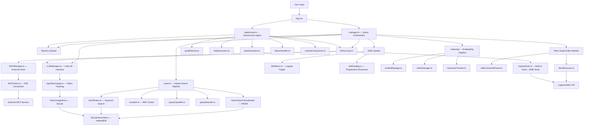
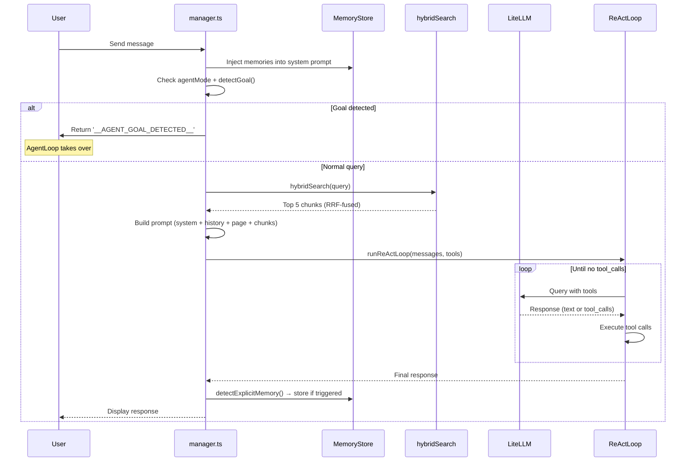
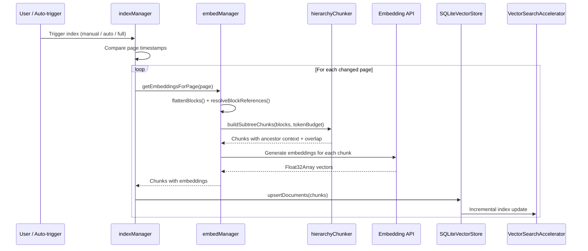
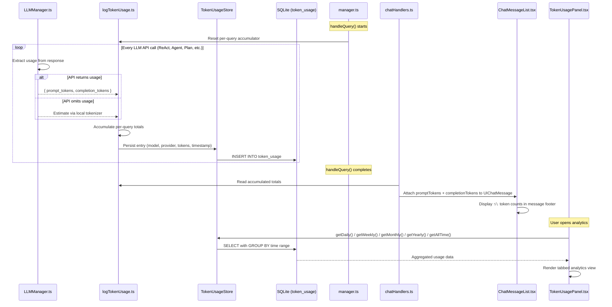

# Architecture

High-level system architecture of Logseq Mixer — module relationships, data flow, and key design decisions.

---

## System Overview


```mermaid
graph TD
    User[User Input] --> App[App.tsx]
    App --> Manager[manager.ts — Query Orchestrator]
    App --> AgentLoop[AgentLoop.ts — Autonomous Agent]
    
    Manager --> Memory[Memory System]
    Manager --> ReAct[ReActLoop.ts]
    Manager --> LLM[LLMManager.ts — LiteLLM Interface]
    Manager --> Skills[Skills System]
    
    AgentLoop --> GoalDetect[goalDetector.ts]
    AgentLoop --> StepExec[stepExecutors.ts]
    AgentLoop --> PlanGen[planGenerator.ts]
    AgentLoop --> FailHandle[failureHandler.ts]
    AgentLoop --> CtxCompress[contextCompressor.ts]
    AgentLoop --> ReAct
    AgentLoop --> Memory
    
    ReAct --> LogseqTools[logseqTools.ts — Built-in Tools + Skills Tools]
    ReAct --> MCP[MCPManager.ts — External Tools]
    ReAct --> LLM
    
    Skills --> SkillStore[SkillStore.ts — Logseq Pages]
    Skills --> SkillCatalog[skillCatalog.ts — Progressive Disclosure]
    
    MCP --> MCPClient[MCPClient.ts — SSE Connection]
    MCPClient --> SSEServer[External MCP Servers]
    
    Manager --> Search[search/ — Hybrid Search Pipeline]
    Search --> BM25[bm25Index.ts — Keyword Search]
    Search --> Vector[VectorSearchAccelerator — HNSW]
    Search --> RRF[reranker.ts — RRF Fusion]
    Search --> QClass[queryClassifier.ts]
    Search --> QRewrite[queryRewriter.ts]
    
    Manager --> Indexing[indexing/ — Embedding Pipeline]
    Indexing --> EmbedMgr[embedManager.ts]
    Indexing --> IdxMgr[indexManager.ts]
    Indexing --> Chunker[hierarchyChunker.ts]
    
    Vector --> SQLite[SQLiteVectorStore — IndexedDB]
    BM25 --> SQLite
    
    LLM --> TokenLog[logTokenUsage.ts — Token Tracking]
    TokenLog --> TokenStore[TokenUsageStore — SQLite]
    TokenStore --> SQLite
    
    Manager --> EditMode[Allow Graph Edits Pipeline]
    EditMode --> EditParser[editCommandParser.ts]
    EditMode --> BlockExec[blockExecutor.ts]
    BlockExec --> LogseqAPI[Logseq Editor API]
    
    LogseqTools --> LogseqAPI
```

---

## Module Map

```
src/
├── main.tsx                    Plugin entry point, lazy initialization
├── App.tsx                     React root — thin shell composing hooks + components
├── manager.ts                  Query orchestrator (handleQuery, context building)
├── LLMManager.ts               LLM communication with retry strategy pipeline
│
├── hooks/
│   ├── useChatSession.ts       Chat state, input, streaming, submit dispatcher
│   ├── chatHandlers.ts         Command handlers (help, raw, tools, chat/agent)
│   ├── useAgentController.ts   Agent plan/running/escalation state
│   ├── useIndexing.ts          Indexing state, progress polling, auto-embed
│   ├── useModelSelection.ts    Model fetching, per-provider model memory
│   ├── usePanelResize.ts       Panel width persistence and drag resize
│   ├── useMemoryMonitor.ts     Heap/DOM pressure tracking
│   ├── useCtrlKey.ts           Ctrl-click link detection
│   ├── useAppVisible.ts        Plugin visibility state
│   └── useThemeMode.ts         Dark/light theme detection
│
├── agent/
│   ├── AgentLoop.ts            Orchestrator: run(), evaluate, replan, synthesize
│   ├── stepExecutors.ts        Step execution (gather, recall, action, specialist, subgoal)
│   ├── failureHandler.ts       Failure diagnosis, rollback, escalation
│   ├── contextCompressor.ts    Context window management
│   ├── planGenerator.ts        Plan generation and step sanitization
│   ├── ReActLoop.ts            Iterative tool chaining (Reason → Act → Observe)
│   ├── goalDetector.ts         LLM-based goal classification
│   ├── logseqTools.ts          Built-in Logseq tools as function schemas
│   ├── modelRouter.ts          Per-step model routing
│   ├── executionGraph.ts       Topological wave grouping
│   ├── outputParser.ts         Structured output parsing
│   └── types.ts                Agent type definitions
│
├── search/
│   ├── bm25Index.ts            In-memory BM25 inverted index with Indonesian stemming
│   ├── hybridSearch.ts         Hybrid search orchestration (vector + keyword)
│   ├── reranker.ts             Reciprocal Rank Fusion
│   ├── recencyScoring.ts       Time-decay scoring for journal pages
│   ├── depthWeightedSearch.ts  Block depth weight adjustment
│   ├── queryClassifier.ts      Query type classification (keyword/semantic/mixed)
│   ├── queryRewriter.ts        LLM-based query rewriting for better retrieval
│   ├── deduplicator.ts         Cross-page chunk deduplication
│   └── index.ts                Public API re-exports
│
├── indexing/
│   ├── embedManager.ts         Block flattening, reference resolution, embedding
│   ├── indexManager.ts         Incremental indexing, auto-index on change
│   ├── hierarchyChunker.ts     Subtree-based chunking with ancestor context
│   ├── chunkMigrationManager.ts  Schema migration management
│   └── index.ts                Public API re-exports
│
├── memory/
│   ├── MemoryStore.ts          CRUD on agent_memory SQLite table
│   ├── memoryDetector.ts       Trigger phrase detection
│   ├── sessionSummarizer.ts    Conversation summarization
│   └── logseqMemoryWriter.ts   Writes memory to Logseq pages
│
├── mcp/
│   ├── MCPClient.ts            Individual SSE connection
│   └── MCPManager.ts           Singleton coordinator
│
├── skills/
│   ├── SkillStore.ts           Load/save/toggle skills from Logseq pages
│   ├── skillParser.ts          Skill markdown format parser
│   ├── skillCatalog.ts         Progressive disclosure prompt builder
│   ├── skillImporter.ts        GitHub URL import
│   └── builtinHelpSkill.ts     Built-in mixer-help skill
│
├── storage/
│   ├── SQLiteVectorStore.ts    Per-document SQLite with IndexedDB persistence
│   ├── VectorSearchAccelerator.ts  HNSW index (hnswlib-wasm)
│   ├── TokenUsageStore.ts      SQLite-backed token usage persistence and aggregation
│   ├── tokenUsageInstance.ts   Singleton accessor (setTokenUsageStore / getTokenUsageStore)
│   ├── logTokenUsage.ts        Per-call logging utility with local tokenizer fallback
│   ├── cosineSimilarity.ts     Embedding encode/decode
│   ├── StorageProvider.ts      Storage interface
│   ├── createStorageProvider.ts  Factory
│   └── migrateLegacy.ts        Orama → SQLite migration
│
├── utils/
│   ├── markdownTransforms.ts   Content parsing (tables, URLs, checkboxes, tags)
│   ├── csvDetector.ts          CSV block detection and parsing
│   ├── cliCodeBlockDetector.ts CLI output wrapping
│   ├── mermaidSanitizer.ts     Mermaid syntax fixes
│   ├── mermaidFixer.ts         LLM-based Mermaid correction
│   ├── plantumlEncoder.ts      PlantUML encoding
│   ├── plantumlFixer.ts        LLM-based PlantUML correction
│   ├── diagramIntentDetector.ts  Diagram request detection
│   └── urlClassifier.ts        URL type detection
│
├── components/
│   ├── ChatHeader.tsx          Header bar (model selector, effort, close)
│   ├── ChatInput.tsx           Input area, toolbar, status bar
│   ├── ChatMessageList.tsx     Chat rendering with markdown + citations
│   ├── DatabasePanel.tsx       DB stats, export/import/clear
│   ├── TokenUsagePanel.tsx     Token usage analytics with tabbed time ranges
│   ├── AgentProgress.tsx       Agent execution progress
│   ├── MCPServerPanel.tsx      MCP server management
│   ├── MemoryPanel.tsx         Memory management
│   ├── SkillPanel.tsx          Skills management
│   ├── ModelSelector.tsx       Model dropdown with search
│   ├── EffortSelector.tsx      Reasoning effort level selector
│   └── ...                     Toggle components, links, charts
│
├── types/
│   ├── chatMessage.ts          UIChatMessage + LLMMessage canonical types (incl. token counts)
│   └── editTypes.ts            Edit command types
│
├── state/
│   └── settings.ts             Recoil atoms for settings
│
└── [root files]
    ├── intentClassifier.ts     Tool inclusion decision logic
    ├── editPromptBuilder.ts    Edit mode system prompt
    ├── editCommandParser.ts    Edit command extraction
    ├── blockExecutor.ts        Edit command execution
    ├── blockTreeFormatter.ts   Page block tree formatting
    ├── blockRefParser.ts       Block reference link transformation
    ├── pageLinkParser.ts       Page link transformation
    ├── normalizer.ts           Block content normalization
    ├── tokenizer.ts            cl100k_base tokenizer
    ├── cooldownManager.ts      Re-index cooldown
    ├── buttonState.ts          Index button state
    ├── helpSystem.ts           /help command handler
    ├── rawCommand.ts           /raw command handler
    ├── toolsCommand.ts         /tools command handler
    └── settings.ts             Plugin settings schema
```

---

## Data Flow: Query Pipeline


```mermaid
sequenceDiagram
    participant U as User
    participant M as manager.ts
    participant Mem as MemoryStore
    participant R as hybridSearch
    participant LLM as LiteLLM
    participant React as ReActLoop

    U->>M: Send message
    M->>Mem: Inject memories into system prompt
    M->>M: Check agentMode + detectGoal()
    alt Goal detected
        M->>U: Return '__AGENT_GOAL_DETECTED__'
        Note over U: AgentLoop takes over
    else Normal query
        M->>R: hybridSearch(query)
        R-->>M: Top 5 chunks (RRF-fused)
        M->>M: Build prompt (system + history + page + chunks)
        M->>React: runReActLoop(messages, tools)
        loop Until no tool_calls
            React->>LLM: Query with tools
            LLM-->>React: Response (text or tool_calls)
            React->>React: Execute tool calls
        end
        React-->>M: Final response
        M->>Mem: detectExplicitMemory() → store if triggered
        M-->>U: Display response
    end
```

### Context Assembly Budget

The available context window (after system prompt) is allocated as follows:

| Layer | Allocation | Source |
|-------|-----------|--------|
| Conversation history | 20% | Last 6 messages (configurable via `MAX_HISTORY_LENGTH`) |
| Page context | 25% | Active page block tree via `fetchPageContext()` |
| Memory | 10% (configurable) | `memoryBudgetPercent` setting |
| RAG chunks | Remaining | Vector + BM25 hybrid search results |

History is assembled newest-first until the budget is exhausted. Older messages are dropped if they exceed the token limit.

---

## Data Flow: Indexing Pipeline


```mermaid
sequenceDiagram
    participant U as User / Auto-trigger
    participant IM as indexManager
    participant EM as embedManager
    participant HC as hierarchyChunker
    participant API as Embedding API
    participant DB as SQLiteVectorStore
    participant HNSW as VectorSearchAccelerator

    U->>IM: Trigger index (manual / auto / full)
    IM->>IM: Compare page timestamps
    loop For each changed page
        IM->>EM: getEmbeddingsForPage(page)
        EM->>EM: flattenBlocks() + resolveBlockReferences()
        EM->>HC: buildSubtreeChunks(blocks, tokenBudget)
        HC-->>EM: Chunks with ancestor context + overlap
        EM->>API: Generate embeddings for each chunk
        API-->>EM: Float32Array vectors
        EM-->>IM: Chunks with embeddings
        IM->>DB: upsertDocuments(chunks)
        DB->>HNSW: Incremental index update
    end
```

---

## Storage Layer

| Component | Technology | Purpose | Persistence |
|---|---|---|---|
| **SQLiteVectorStore** | sql.js (WASM) | Document chunks, embeddings, block metadata | IndexedDB (binary ArrayBuffer) |
| **VectorSearchAccelerator** | hnswlib-wasm | Fast approximate nearest neighbor search | Volatile (rebuilt from SQLite on startup) |
| **BM25Index** | Custom in-memory | Keyword search (inverted index) | Volatile (rebuilt from SQLite on startup) |
| **Agent Memory** | SQLite `agent_memory` table | Preferences, facts, tasks, summaries | IndexedDB (same database) |
| **Token Usage** | SQLite `token_usage` table | Per-call token counts, model, provider | IndexedDB (same database) |
| **Memory Pages** | Logseq graph | Long-term knowledge in RAG pipeline | Logseq's storage |
| **Input History** | localStorage | Persistent chat input history (max 100) | Browser storage |
| **MCP Preferences** | localStorage | Tool enable/disable state | Browser storage |
| **Panel Width** | localStorage | Persisted panel width (320–85% viewport) | Browser storage |
| **Provider Models** | localStorage | Per-provider model selections | Browser storage |
| **Legacy (Orama)** | Orama in-memory | Vector search for `settings` backend | Logseq plugin settings (JSON blob) |

> 📖 [Full storage & database reference →](https://github.com/indraginanjar/logseq-mixer/blob/main/docs/technical/storage.md)

---

## Data Flow: Token Usage Tracking


```mermaid
sequenceDiagram
    participant LLM as LLMManager.ts
    participant Log as logTokenUsage.ts
    participant Store as TokenUsageStore
    participant DB as SQLite (token_usage)
    participant Mgr as manager.ts
    participant Chat as chatHandlers.ts
    participant UI as ChatMessageList.tsx
    participant Panel as TokenUsagePanel.tsx

    Note over Mgr: handleQuery() starts
    Mgr->>Log: Reset per-query accumulator

    loop Every LLM API call (ReAct, Agent, Plan, etc.)
        LLM->>LLM: Extract usage from response
        alt API returns usage
            LLM-->>Log: { prompt_tokens, completion_tokens }
        else API omits usage
            LLM-->>Log: Estimate via local tokenizer
        end
        Log->>Log: Accumulate per-query totals
        Log->>Store: Persist entry (model, provider, tokens, timestamp)
        Store->>DB: INSERT INTO token_usage
    end

    Note over Mgr: handleQuery() completes
    Chat->>Log: Read accumulated totals
    Chat->>UI: Attach promptTokens + completionTokens to UIChatMessage
    UI->>UI: Display ↑/↓ token counts in message footer

    Note over Panel: User opens analytics
    Panel->>Store: getDaily() / getWeekly() / getMonthly() / getYearly() / getAllTime()
    Store->>DB: SELECT with GROUP BY time range
    DB-->>Panel: Aggregated usage data
    Panel->>Panel: Render tabbed analytics view
```

### How it works

Every LLM API call — whether from the ReAct loop, agent step executors, plan generator, context compressor, or failure handler — reports token usage via `logTokenUsage()`. The utility:

1. **Captures actual counts** from the API response when available (OpenAI, LiteLLM).
2. **Falls back to local estimation** using the cl100k_base tokenizer when the provider doesn't report usage.
3. **Accumulates per-query totals** so the chat UI can display combined input/output tokens for the entire query.
4. **Persists each entry** to the `token_usage` SQLite table for long-term analytics.

### Provider-specific extraction

| Provider | Source | Notes |
|---|---|---|
| **OpenAI / LiteLLM** | `response.usage` object | For streaming: `stream_options: { include_usage: true }` captures usage from final SSE chunk |
| **Ollama** | `prompt_eval_count` / `eval_count` | Normalized to standard `prompt_tokens` / `completion_tokens` format |
| **Other** | Local tokenizer | Counts tokens from prompt and completion text as fallback |

### Storage schema

```sql
CREATE TABLE token_usage (
    id              INTEGER PRIMARY KEY AUTOINCREMENT,
    timestamp       INTEGER NOT NULL,  -- Unix epoch ms
    model           TEXT NOT NULL,
    provider        TEXT NOT NULL,
    prompt_tokens   INTEGER NOT NULL,
    completion_tokens INTEGER NOT NULL,
    total_tokens    INTEGER NOT NULL
);
```

### Aggregation

`TokenUsageStore` provides time-range aggregation methods:

| Method | Grouping |
|---|---|
| `getDaily()` | Last 24 hours, grouped by hour |
| `getWeekly()` | Last 7 days, grouped by day |
| `getMonthly()` | Last 30 days, grouped by day |
| `getYearly()` | Last 365 days, grouped by month |
| `getAllTime()` | All entries, grouped by month |

### UI integration

- **Per-message counters:** `ChatMessageList.tsx` renders ↑ (input) and ↓ (output) token counts in each assistant message footer, sourced from `UIChatMessage.promptTokens` and `completionTokens`.
- **Analytics panel:** `TokenUsagePanel.tsx` provides tabbed views (daily / weekly / monthly / yearly / all-time) with usage breakdowns by model and provider.

---

## Plugin Lifecycle

### Startup Sequence

```
1. main.tsx: Register toolbar button + UI model (synchronous — no blocking)
2. main.tsx: Create lazy StorageProvider proxy (defers WASM/SQLite init)
3. requestIdleCallback: Begin SQLite initialization when browser is idle
4. First method call on proxy: Triggers full initialization if not started
5. After DB ready: Initialize TokenUsageStore (setTokenUsageStore)
6. After DB ready: Build HNSW index from all embeddings
7. After HNSW ready: Build BM25 index from all document content
8. Register logseq.DB.onChanged() listener for auto-indexing
```

### Performance Optimizations

| Technique | Impact |
|---|---|
| **Lazy tokenizer** | ~1.5 MB encoding table loaded via dynamic `import()` on first use |
| **Lazy storage proxy** | WASM compilation deferred to idle time via `requestIdleCallback` |
| **Vite chunk splitting** | sql.js, Orama, tiktoken in separate chunks (loaded on demand) |
| **Yield points** | `await` between WASM load and DB restore to keep UI responsive |
| **Synchronous toolbar** | Plugin icon appears instantly, before any heavy initialization |

---

## Key Design Decisions

### Why LiteLLM instead of direct API calls?

LiteLLM provides a single OpenAI-compatible interface to 100+ providers. This means:
- One endpoint format for all models (no provider-specific code)
- Users can switch models without plugin changes
- Multi-model configs (different models for different purposes)
- Proxy handles auth, rate limiting, and retries

### Why SQLite + IndexedDB instead of localStorage?

- **Scalability:** localStorage has a 5-10 MB limit. SQLite handles gigabytes.
- **Binary storage:** Embeddings stored as raw Float32Array BLOBs (4 bytes/float) — no JSON serialization overhead.
- **Structured queries:** SQL enables efficient lookups, updates, and metadata queries.
- **Corruption resilience:** Binary snapshot restore vs. JSON parse errors.

### Why HNSW + brute-force fallback?

- **HNSW:** Sub-5ms queries at 20k+ chunks. Essential for responsive UX.
- **Volatile:** HNSW lives only in memory (rebuilt on startup from SQLite).
- **Fallback:** If WASM fails or index isn't ready, cosine similarity scan works for any graph size (just slower).
- **Automatic:** Users never interact with this — it's transparent.

### Why dual memory storage (SQLite + Logseq pages)?

- **SQLite:** Fast structured access for real-time injection into prompts.
- **Logseq pages:** Participate in RAG pipeline — memories are searchable alongside notes.
- **Complementary:** SQLite for immediate recall, pages for long-term knowledge retrieval.

---

## Related Documentation

- [Storage & Database](https://github.com/indraginanjar/logseq-mixer/blob/main/docs/technical/storage.md) — Full database schema, persistence layers, data lifecycle
- [Retrieval Pipeline](https://github.com/indraginanjar/logseq-mixer/blob/main/docs/technical/retrieval-pipeline.md) — Embedding, chunking, hybrid search internals
- [Agent Internals](https://github.com/indraginanjar/logseq-mixer/blob/main/docs/technical/agent-internals.md) — Agent loop, ReAct, self-correction
- [MCP Protocol](https://github.com/indraginanjar/logseq-mixer/blob/main/docs/technical/mcp-protocol.md) — Transport layer and tool calling
