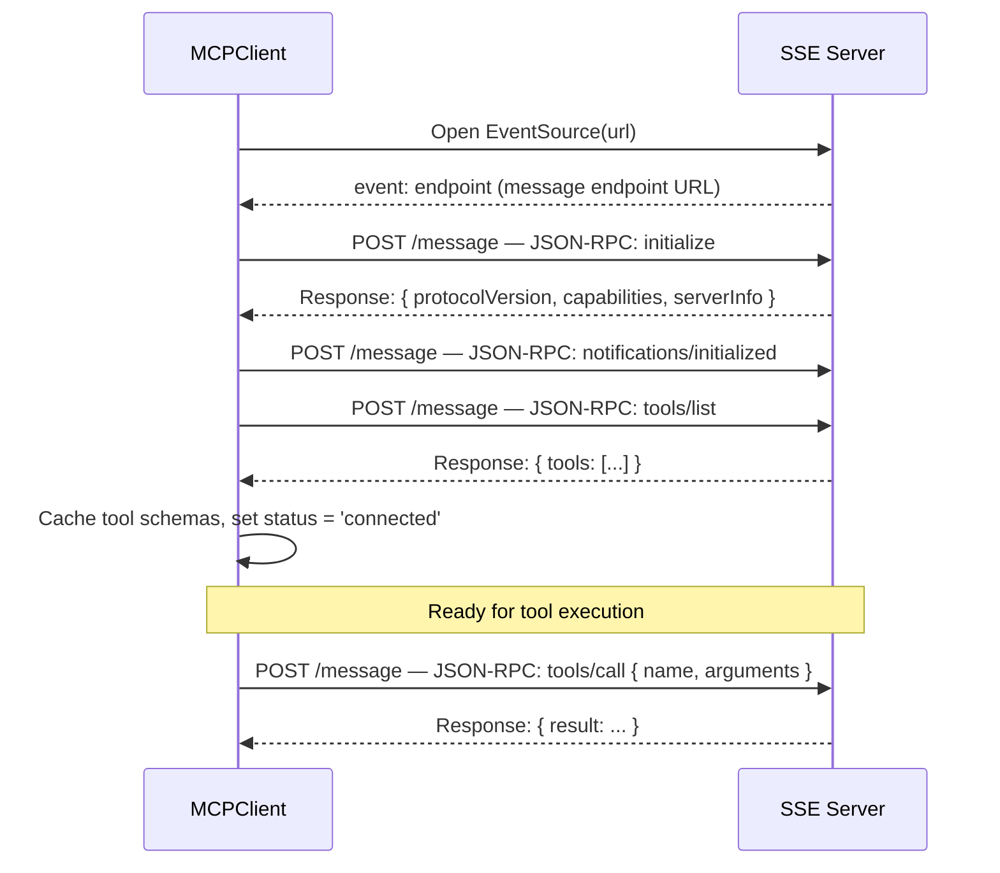
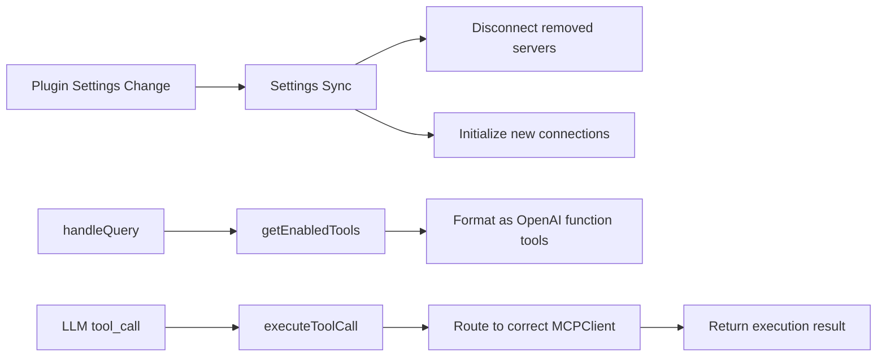
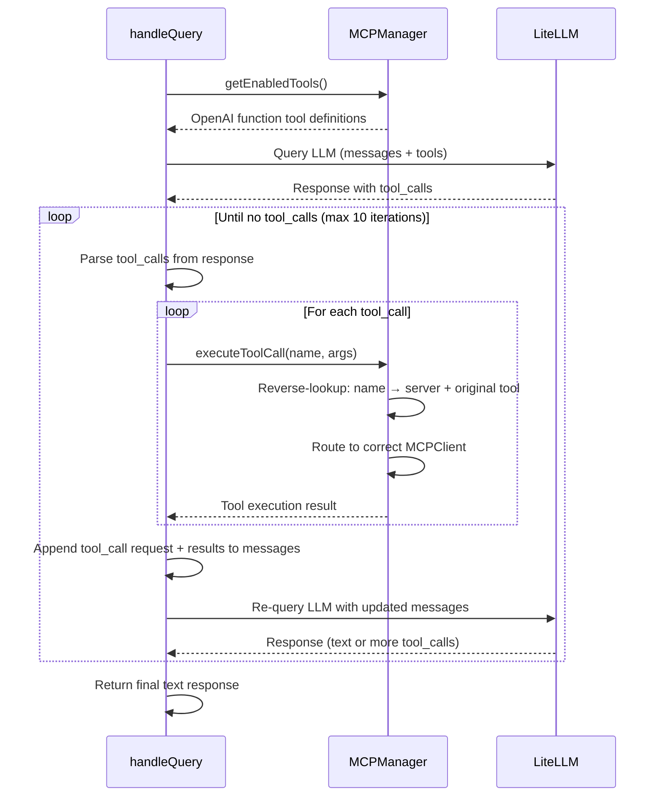

# MCP Protocol Integration

Implementation details of Model Context Protocol (MCP) support in Logseq Mixer — transport layer, client lifecycle, tool discovery, and the LLM tool-calling loop.

---

## Architectural Constraint: Browser Sandbox

Logseq plugins run inside sandboxed browser iframes. This imposes strict security constraints:

- **No process spawning** — stdio-based MCP transport is impossible from within the sandbox
- **No direct filesystem access** — cannot read local config files or sockets
- **HTTP/SSE only** — the plugin can only make outbound HTTP requests and open EventSource connections

Consequently, Mixer implements **SSE-based MCP transport** exclusively. For stdio-based servers (the majority of MCP ecosystem), users run a local bridge proxy (`supergateway` or `mcp-proxy`) that exposes an HTTP/SSE endpoint.

---

## Core Components

```mermaid
graph TD
    App[App.tsx] -->|Initializes & Syncs| Manager[MCPManager.ts]
    App -->|Renders| Toolbar[🔌 Toggle Button]
    App -->|Renders Overlay| UI[MCPServerPanel.tsx]
    
    UI -->|Subscribes & Toggles| Manager
    Manager -->|Spawns / Cleans| Client1[MCPClient — Server A]
    Manager -->|Spawns / Cleans| Client2[MCPClient — Server B]
    
    Client1 -->|EventSource| SSE1[SSE MCP Server A]
    Client2 -->|EventSource| SSE2[SSE MCP Server B]
    
    LLM[manager.ts handleQuery] -->|getEnabledTools()| Manager
    LLM -->|executeToolCall()| Manager
    Manager -->|Routes to correct client| Client1
    Manager -->|Routes to correct client| Client2
```

---

## MCPClient (`src/mcp/MCPClient.ts`)

Represents a single connection to one SSE-based MCP server.

### Connection Lifecycle



### Key Behaviors

| Aspect | Implementation |
|---|---|
| **Transport** | Native browser `EventSource` (SSE) for connection, HTTP POST for messages |
| **Endpoint discovery** | Listens for `endpoint` event to determine the POST message URL |
| **Initialization** | Sends `initialize` request (with protocolVersion, clientInfo, capabilities), waits for response, then sends `notifications/initialized` notification |
| **Tool discovery** | Sends `tools/list` JSON-RPC request after initialization handshake completes |
| **Tool execution** | Sends `tools/call` JSON-RPC POST with tool name and arguments |
| **Response handling** | Resolves from POST response body (synchronous) or SSE message (async) |
| **Error states** | Connection failure → status `'error'` with descriptive message |
| **Stdio detection** | Config without `url` → immediate `'error'` status: "Stdio servers not supported in browser. Use an SSE bridge proxy." |

---

## MCPManager (`src/mcp/MCPManager.ts`)

Singleton coordinator for multiple MCP client connections.

### Responsibilities



### Settings Sync

On startup and whenever settings change:
1. Parse `mcpServers` config (supports 3 formats)
2. Diff against currently connected servers
3. Disconnect removed servers (close EventSource)
4. Initialize connections to new servers
5. Keep existing connections that haven't changed

### Function Name Mapping

MCP tools have arbitrary names, but the OpenAI function calling API requires names matching `/^[a-zA-Z0-9_-]{1,64}$/`.

**Strategy:**
1. Generate candidate: `{serverName}_{toolName}` (sanitized)
2. If ≤64 characters → use directly
3. If >64 characters → hash to shorten, maintain reverse lookup cache

```typescript
// Forward: MCP tool → OpenAI function name
toolNameMap: Map<string, string>

// Reverse: OpenAI function name → { serverName, originalToolName }
reverseMap: Map<string, { server: string; tool: string }>
```

### Preference Persistence

Tool enable/disable state is stored in `localStorage`:
- Key: `logseq-mixer:mcp-tools`
- Value: JSON object mapping function names to boolean
- Survives page reloads and plugin restarts

---

## Settings Configuration

The `mcpServers` setting is parsed by a flexible parser supporting three formats:

### Format A: Key-Value Object Map (Recommended)

```json
{
  "filesystem": { "url": "http://localhost:3001/sse" },
  "playwright": { "url": "http://localhost:3002/sse" }
}
```

### Format B: Wrapped Object Map

Allows pasting a full config file from other MCP clients (e.g., Claude Desktop):

```json
{
  "mcpServers": {
    "filesystem": { "url": "http://localhost:3001/sse" }
  }
}
```

### Format C: Array of Objects (Legacy)

```json
[
  { "name": "filesystem", "url": "http://localhost:3001/sse" }
]
```

### Stdio Entries

If a server config has `command` instead of `url`:
- Connection status set to `'error'`
- Error message: "Stdio servers not supported in browser. Use an SSE bridge proxy."
- Displayed in UI with guidance

---

## UI Component (`src/components/MCPServerPanel.tsx`)

### Toggle Button

A **🔌 MCP Servers** button in the toolbar row. Opens an overlay panel.

### Panel Listing

| Status | Color | Meaning |
|---|---|---|
| `connected` | 🟢 Green | Online, tools available |
| `connecting` | 🟡 Amber | EventSource opening |
| `disconnected` | ⚪ Grey | Not connected |
| `error` | 🔴 Red | Failed (shows error message) |

### Tool Toggling

- Click server card to expand
- Connected servers show tool count and individual toggle switches
- Toggle state persisted to localStorage
- Disabled tools excluded from `getEnabledTools()` response

---

## LLM Integration: Tool Calling Loop

The tool calling loop lives in `manager.ts` inside `handleQuery()`:



### Loop Details

1. **Retrieve active tools:** `MCPManager.getInstance().getEnabledTools()` returns tools formatted as OpenAI function definitions
2. **Initial LLM call:** Tools passed alongside messages to `queryLiteLLM()`
3. **Intercept tool calls:** If response contains `tool_calls`:
   - Extract tool name and JSON arguments
   - Execute via `MCPManager.getInstance().executeToolCall(name, parsedArgs)`
   - Append assistant message (with tool_call) and tool result (role: `tool`) to message list
4. **Re-query:** LLM called again with full message history including tool results
5. **Termination:** Loop ends when LLM returns text without tool_calls, or after 10 iterations (safety cap)
6. **Final response:** Stored in conversation history

### Tool Result Format

Tool results are added to the message list as:
```json
{
  "role": "tool",
  "tool_call_id": "call_abc123",
  "content": "{ ... tool execution result ... }"
}
```

---

## Integration with Agent System

When the agent (`AgentLoop.ts`) executes steps of type `tool` or `search`, it delegates to `ReActLoop.ts` which uses the same MCP infrastructure:

1. Agent step specifies what to achieve
2. ReAct loop receives the step objective + all available tools
3. LLM decides which MCP/Logseq tools to call
4. Tools are executed through MCPManager
5. Results flow back through ReAct loop to agent

This means **MCP tools are available in all three contexts:**
- Normal chat (via ReAct loop in handleQuery)
- Agent steps (via ReAct loop in AgentLoop)
- Direct tool calls (single-shot, no looping)

---

## Error Handling

| Failure | Behavior |
|---|---|
| SSE connection refused | Status → `'error'`, descriptive message in panel |
| SSE connection dropped | Status → `'disconnected'`, tools removed from active set |
| Initialization fails | Status → `'error'` with "Initialization failed" message |
| `tools/list` fails | Status stays `'connecting'`, retries on reconnect |
| Tool execution timeout | Error propagated to LLM as tool result |
| Tool execution error | Error message returned as tool result (LLM can reason about it) |
| Invalid function name | Reverse lookup fails → error logged, tool call skipped |
| Config parse failure | All entries treated as invalid, error logged |

---

## File Reference

| File | Responsibility |
|---|---|
| `src/mcp/MCPClient.ts` | Individual SSE connection, EventSource lifecycle, JSON-RPC communication |
| `src/mcp/MCPManager.ts` | Singleton coordinator, settings sync, name mapping, execution routing |
| `src/components/MCPServerPanel.tsx` | UI: server listing, connection status, tool toggles |
| `src/manager.ts` | Tool calling loop integration (getEnabledTools → LLM → executeToolCall) |
| `src/agent/ReActLoop.ts` | Iterative tool chaining (uses MCPManager for MCP tools) |
| `src/agent/logseqTools.ts` | Built-in Logseq tools (merged with MCP tools in tool list) |
| `src/settings.ts` | `mcpServers` setting definition |

---

## Related Documentation

- [Architecture](https://github.com/indraginanjar/logseq-mixer/blob/main/docs/technical/architecture.md) — System overview showing MCP in context
- [Agent Internals](https://github.com/indraginanjar/logseq-mixer/blob/main/docs/technical/agent-internals.md) — How the agent uses MCP tools
- [MCP Tools (User Guide)](https://github.com/indraginanjar/logseq-mixer/blob/main/docs/user/mcp-tools.md) — Setup and configuration for users
