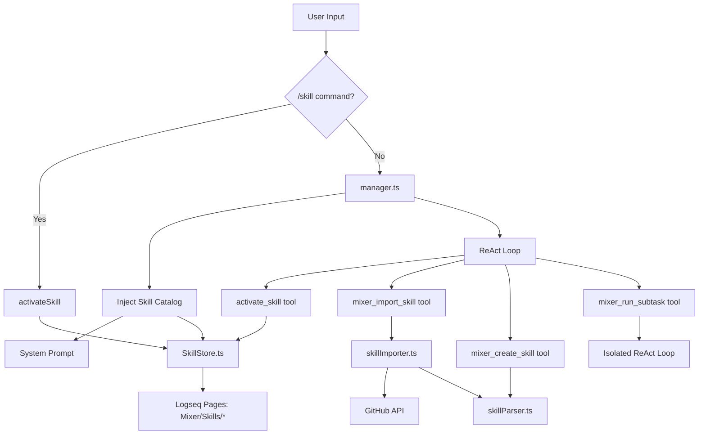

# Skills System

Technical documentation for the Agent Skills module — storage format, progressive disclosure architecture, tool integration, and subagent delegation.

---

## Architecture Overview



---

## Module Map

| Module | Location | Responsibility |
|--------|----------|----------------|
| SkillStore | `src/skills/SkillStore.ts` | CRUD operations on Logseq skill pages |
| skillParser | `src/skills/skillParser.ts` | Parse SKILL.md, validate names, convert formats |
| skillImporter | `src/skills/skillImporter.ts` | Fetch/import from GitHub URLs |
| skillCatalog | `src/skills/skillCatalog.ts` | Build system prompt catalog and activation context |
| Tool definitions | `src/agent/logseqTools.ts` | activate_skill, mixer_import_skill, mixer_create_skill, mixer_run_subtask |
| Integration | `src/manager.ts` | Catalog injection, /skill command, session state |
| UI | `src/components/SkillPanel.tsx` | Management panel |

---

## Storage Format

Skills are stored as Logseq pages under the `Mixer/Skills/` namespace. Each page has:

### Properties Block (first block)

```
name:: pdf-processing
description:: Extract PDF text, fill forms, merge files. Use when handling PDFs.
enabled:: true
source:: github:user/repo/skills/pdf-processing
license:: Apache-2.0
version:: 1.0
metadata:: {"author":"example-org"}
```

### Body Blocks (child blocks of first block, or sibling blocks after first)

The instruction content, stored as individual Logseq blocks (one per non-empty line).

### Reading Skills

`loadAllSkills()` in SkillStore.ts:
1. Calls `logseq.Editor.getAllPages()` and filters by `Mixer/Skills/` prefix
2. For each page, reads the block tree via `logseq.Editor.getPageBlocksTree()`
3. Extracts properties from the first block's `properties` field
4. Collects body content from child/sibling blocks with indentation preserved
5. Returns `SkillEntry[]` with parsed metadata and body text

---

## Progressive Disclosure

Follows the [agentskills.io specification](https://agentskills.io/client-implementation/adding-skills-support) three-tier model:

### Tier 1: Catalog (~50-100 tokens per skill)

Injected into the system prompt on every query:

```
## Available Skills
The following skills provide specialized instructions for specific tasks.
When a task matches a skill's description, call the `activate_skill` tool.
The user can also activate a skill with `/skill <name>` in chat.

- **pdf-processing**: Extract PDF text, fill forms, merge files.
- **code-review**: Review code for error handling and type safety.
```

**When:** Every query (if `skillsEnabled !== false`)
**Where:** `manager.ts` → `handleQuery()` → after memory injection
**Cost:** Minimal — only names and descriptions

### Tier 2: Full Instructions (< 5000 tokens recommended)

Loaded when the skill is activated:

```xml
<skill_content name="pdf-processing">

# PDF Processing Instructions
...

</skill_content>
```

**When:** Activation via `/skill` command, `activate_skill` tool call, or user request
**Where:** Injected into the context block as "Activated Skill Instructions"
**Deduplication:** Tracked per session in `activatedSkills` Set — same skill won't load twice

### Tier 3: Resources (not applicable)

In file-system-based implementations, skills can have `scripts/`, `references/`, and `assets/` directories. In Mixer's Logseq-page-based approach, all content is in the body blocks. Extended resources can be referenced as other Logseq pages.

---

## Activation Flow

### 1. Slash Command: `/skill <name> [message]`

```
handleQuery() → detect /skill regex
  → activateSkill(name)
    → loadAllSkills() → find by name → check enabled
    → add to activatedSkills Set
    → return buildSkillActivationContext(skill)
  → inject into contextBlock
  → process remaining message through normal flow
```

### 2. Model-Driven: `activate_skill` tool call

```
ReAct Loop → LLM decides to call activate_skill
  → executeLogseqTool('activate_skill', {name})
    → activateSkill(name) from manager.ts
    → returns skill body wrapped in <skill_content> tags
  → tool result added to conversation
  → LLM continues with skill instructions in context
```

### 3. Natural Language

The LLM sees the catalog in its system prompt. When a user's request matches a skill description, the LLM autonomously calls `activate_skill`.

---

## Tool Definitions

### activate_skill

| Parameter | Type | Required | Description |
|-----------|------|----------|-------------|
| name | string | Yes | Skill name from the catalog |

Returns: Full skill body in `<skill_content>` wrapper, or error message.

### mixer_import_skill

| Parameter | Type | Required | Description |
|-----------|------|----------|-------------|
| url | string | Yes | GitHub URL (blob, tree, or repo) |

Flow: `normalizeGitHubUrl()` → `fetch()` → `parseSkillMd()` → `saveSkill()`

### mixer_create_skill

| Parameter | Type | Required | Description |
|-----------|------|----------|-------------|
| name | string | Yes | Skill name (validated) |
| description | string | Yes | Skill description |
| body | string | No | Full instructions (for AI-generated skills) |
| blockUUID | string | No | Block to convert (alternative to body) |

Either `body` or `blockUUID` must be provided. If `blockUUID` is given, it takes precedence.

### mixer_run_subtask

| Parameter | Type | Required | Description |
|-----------|------|----------|-------------|
| task | string | Yes | What the subtask should accomplish |
| skill | string | No | Skill to activate in the subagent |
| maxIterations | number | No | Max tool call iterations (default: 15) |

Creates an isolated `runReActLoop` call with:
- Fresh system prompt (focused subagent role)
- Optional skill activation context
- Full Logseq tool + MCP tool access
- No shared conversation history with parent

Returns: `[Subtask completed in N iterations, M tool calls]\n\n<answer>`

---

## SKILL.md Parsing

`skillParser.ts` implements lenient YAML frontmatter parsing:

1. Detect `---` opening delimiter at start of content
2. Find closing `---` delimiter
3. Parse YAML block between delimiters (simple key: value parser)
4. Handle edge cases:
   - Unquoted values with colons (e.g., `description: Use when: the user asks`)
   - Nested blocks (e.g., `metadata:` with indented children)
   - Quoted values (single or double quotes stripped)
5. Everything after closing `---` is the body

### Name Validation

Per agentskills.io spec:
- 1-64 characters
- Only `[a-z0-9-]`
- No leading/trailing hyphens
- No consecutive hyphens (`--`)

---

## GitHub URL Normalization

`skillImporter.ts` converts GitHub URLs to raw content URLs:

| Input Pattern | Output |
|--------------|--------|
| `raw.githubusercontent.com/...` | Unchanged |
| `github.com/user/repo/blob/branch/path` | `raw.githubusercontent.com/user/repo/branch/path` |
| `github.com/user/repo/tree/branch/path` | `raw.githubusercontent.com/user/repo/branch/path/SKILL.md` |
| `github.com/user/repo` | `raw.githubusercontent.com/user/repo/main/SKILL.md` |

Fallback: If `main` branch fails, retries with `master`.

---

## Session State

| State | Location | Lifecycle |
|-------|----------|-----------|
| `activatedSkills` | `manager.ts` (Set) | Cleared on `clearConversationHistory()` (new session) |
| `cachedSkillCatalog` | `manager.ts` | Refreshed every query |
| `_subtaskSettings` | `logseqTools.ts` | Set before each `runReActLoop` call |

---

## Tool Routing

In `ReActLoop.ts`, tool calls are dispatched by prefix:

```typescript
if (funcName.startsWith('logseq_') || funcName.startsWith('mixer_') || funcName === 'activate_skill') {
  toolResult = await executeLogseqTool(funcName, args);
} else {
  toolResult = await MCPManager.getInstance().executeToolCall(funcName, args);
}
```

---

## Built-in Skills

`src/skills/builtinHelpSkill.ts` provides auto-provisioned skills:

### mixer-help

- **Created by:** `ensureBuiltinHelpSkill()` called in App.tsx useEffect on mount
- **Version tracked:** `BUILTIN_SKILL_VERSION` constant — only recreated when version changes
- **Content:** ~4000 tokens of comprehensive Mixer documentation
- **Source field:** `builtin` (distinguishes from user-created or imported)

Initialization flow:
1. App mounts → `ensureBuiltinHelpSkill()` called
2. Checks if `Mixer/Skills/mixer-help` page exists via `getSkill('mixer-help')`
3. If missing or version mismatch → `saveSkill()` creates/updates the page
4. Skill appears in catalog on next query

---

## Testing

Unit tests in `src/skills/`:
- `skillParser.test.ts` — Name validation, SKILL.md parsing, format conversion, roundtrip
- `skillCatalog.test.ts` — Catalog generation, activation wrapping, URL normalization

Integration verified via:
- `src/agent/ReActLoop.test.ts` — SKILL_TOOLS included in tool array
- `src/manager.editMode.test.ts` — Skills catalog injection (graceful failure when logseq unavailable)
